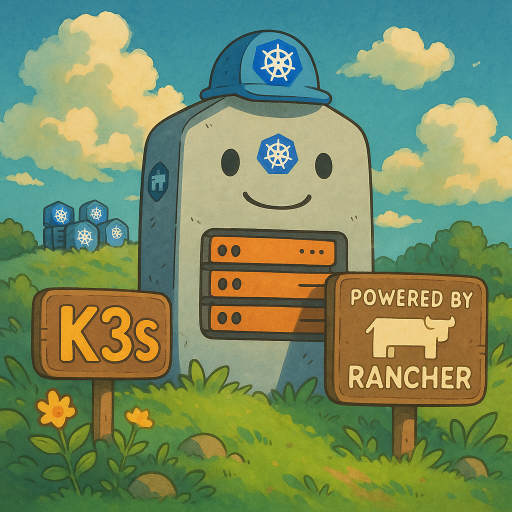

  

<!--more-->

## K3s 簡介 (Introduction)

K3s 是一個輕量級的 Kubernetes 發行版，專為邊緣計算 (Edge Computing)、物聯網 (IoT) 設備以及資源受限的環境而設計。它由 Rancher Labs 開發，旨在提供一個易於安裝、運行和維護的生產級 Kubernetes 集群。

### K3s 的核心優勢

節錄自官方網站，K3s 具備以下幾個關鍵特性：

*   **Perfect for Edge (完美適用於邊緣環境)**
    K3s 是一個高可用、經過認證的 Kubernetes 發行版，專為在無人值守、資源受限、遠端位置或物聯網設備內部運行生產工作負載而設計。這意味著它可以在傳統 Kubernetes 無法有效運行的環境中提供強大的容器編排能力。

*   **Simplified & Secure (簡化與安全)**
    K3s 被打包成一個單一的二進制文件，大小不到 70MB。這大大減少了安裝、運行和自動更新生產級 Kubernetes 集群所需的依賴項和步驟。其輕量級的特性也降低了攻擊面，提升了安全性。

*   **Optimized for ARM (針對 ARM 架構優化)**
    K3s 同時支持 ARM64 和 ARMv7 架構，並提供相應的二進制文件和多架構鏡像。無論是像 Raspberry Pi 這樣的小型設備，還是 AWS a1.4xlarge 32GiB 服務器，K3s 都能高效運行。

### K3s 的關鍵特點解析

基於上述官方介紹，我們可以歸納出 K3s 的幾個重要特點：

*   **支持高可用性 (Support HA)**
    K3s 能夠配置為高可用集群，確保控制平面在節點故障時仍能持續運行。它支持使用嵌入式 SQLite 或外部數據庫（如 PostgreSQL、MySQL、MariaDB 和 etcd）來存儲集群狀態，這為不同規模和需求提供了靈活性。

*   **支持集群部署 (Support Cluster)**
    K3s 不僅限於單節點部署，也能夠輕鬆擴展為多節點集群，包含一個或多個服務器節點（控制平面）和多個代理節點（工作節點），以滿足不同應用場景的需求。

*   **單一二進制文件，易於維護 (Single Binary, Easy Maintain)**
    K3s 的所有核心組件都集成在一個單一的二進制文件中，極大地簡化了部署和升級過程。這減少了管理多個獨立組件的複雜性，降低了運維成本。

*   **低資源佔用 (Low Resource Usage)**
    相較於標準的 Kubernetes，K3s 移除了許多企業級功能（如雲提供商集成、舊版 API 等），並用輕量級替代品替換了部分組件（如使用 containerd 替代 Docker，使用 Traefik 替代 Ingress Controller）。這使得它在內存和 CPU 消耗方面顯著降低，非常適合資源受限的環境。

*   **環境接近原生 Kubernetes (Close to Native K8s Environment)**
    儘管 K3s 進行了輕量化處理，但它仍然是一個完全兼容的 Kubernetes 發行版。它通過了 CNCF 的一致性認證，這意味著您在標準 Kubernetes 上運行的應用程序和工具，在 K3s 上也能正常運行，提供了接近原生的 Kubernetes 體驗。

### 架構概覽 (Architecture Overview)

先看官方的架構圖  


首先，K3s 的架構主要分為兩種角色：

*   **K3s Server (控制平面節點)**：
    K3s Server 扮演著傳統 Kubernetes 中控制平面的角色，負責管理集群的狀態、調度工作負載、處理 API 請求等。它包含了 API Server、Controller Manager、Scheduler 和一個輕量級的數據庫（默認是嵌入式 SQLite，也可配置為外部數據庫如 PostgreSQL、MySQL、MariaDB 或 etcd）。

*   **K3s Agent (工作節點)**：
    K3s Agent 則作為工作節點，負責運行應用程序的容器。它包含了 Kubelet 和一個輕量級的容器運行時（默認是 containerd）。Agent 節點會向 Server 節點註冊，並從 Server 接收指令來運行和管理 Pod。

### K3s 與原生 Kubernetes 的架構差異

K3s 在架構上與原生 Kubernetes 有幾個顯著的不同點，這些差異是其輕量化和易用性的關鍵：

1.  **默認無 Taints (No Taints by Default)**：
    與原生 Kubernetes 不同，K3s Server 節點默認不會設置 `NoSchedule` 或 `NoExecute` 的 Taints。這意味著 Pod 可以直接調度到 K3s Server 節點上運行，這對於單節點或小型集群來說非常方便，減少了額外的配置步驟。

2.  **內置組件 (Bundled Components)**：
    為了簡化安裝和部署，K3s 預設集成了許多 Kubernetes 所需的核心組件，無需用戶手動配置。這些內置組件包括：
    *   **容器運行時 (Container Runtime)**：默認使用 containerd，一個輕量級且符合 OCI 標準的容器運行時。
    *   **CNI (Container Network Interface)**：默認使用 Flannel 作為網絡插件，提供 Pod 間的網絡連接。
    *   **CoreDNS**：提供集群內部的 DNS 服務。
    *   **Traefik Ingress Controller**：作為默認的 Ingress Controller，用於暴露集群內部的服務到外部。
    *   **Service Load Balancer (ServiceLB)**：一個輕量級的服務負載均衡器，用於將外部流量導向集群內的服務。
    *   **嵌入式數據庫 (Embedded Database)**：默認使用 SQLite，極大地簡化了單節點部署的數據庫管理。

    詳細的內置組件列表和版本信息，可以參考 K3s 的 [Release Note](https://github.com/k3s-io/k3s/releases)。
    

3.  **可替換的組件 (Pluggable Components)**：
    儘管 K3s 提供了許多內置組件，但它也保留了高度的靈活性，允許用戶根據需求替換或配置不同的組件：
    *   **容器運行時 (Container Runtime)**：除了 containerd，K3s 也支持其他容器運行時，例如 Docker (通過 `k3s --docker` 選項)。詳情請參考 [K3s Advanced Options - Alternative Container Runtime Support](https://docs.k3s.io/advanced#alternative-container-runtime-support)。
    *   **CNI (Container Network Interface)**：用戶可以選擇使用 Calico、Cilium 等其他 CNI 插件來替代 Flannel。詳情請參考 [K3s Networking - Custom CNI](https://docs.k3s.io/networking/basic-network-options#custom-cni)。
    *   **持久化存儲 (Volumes and Storage)**：K3s 支持多種持久化存儲解決方案，例如 Longhorn、NFS 等。詳情請參考 [K3s Storage - Setting up Longhorn](https://docs.k3s.io/storage#setting-up-longhorn)。

這些設計選擇使得 K3s 在保持 Kubernetes 核心功能的前提下，實現了極致的輕量化和易用性，使其成為邊緣計算和資源受限環境的理想選擇。

## 快速入門 (Getting Started)

K3s 的安裝過程極其簡單，只需一條命令即可在 Linux 系統上快速部署一個單節點集群。

### 安裝 K3s

在您的 Linux 服務器或虛擬機上執行以下命令：

```bash
curl -sfL https://get.k3s.io | sh -
```

這條命令會自動下載 K3s 二進制文件，並將其安裝為一個 systemd 服務。安裝完成後，K3s 服務會自動啟動，並配置好一個單節點的 Kubernetes 集群。

### 驗證安裝

安裝完成後，您可以通過以下命令驗證 K3s 集群是否正常運行：

```bash
sudo kubectl get nodes
sudo kubectl get pods --all-namespaces
```

如果一切正常，您應該會看到一個 `Ready` 狀態的節點，以及 K3s 系統組件的 Pod 正在運行。

## 總結 (Conclusion)

K3s 作為一個輕量級的 Kubernetes 發行版，憑藉其小巧的體積、簡化的安裝流程和低資源佔用等優勢，在邊緣計算、物聯網、開發測試環境以及 CI/CD 等場景中展現出巨大的潛力。它不僅降低了 Kubernetes 的學習和使用門檻，也為資源受限的環境提供了強大的容器編排能力。

下一篇文章，我將深入探討 K3s 的進階使用方法，包括多節點集群部署、高可用配置等。