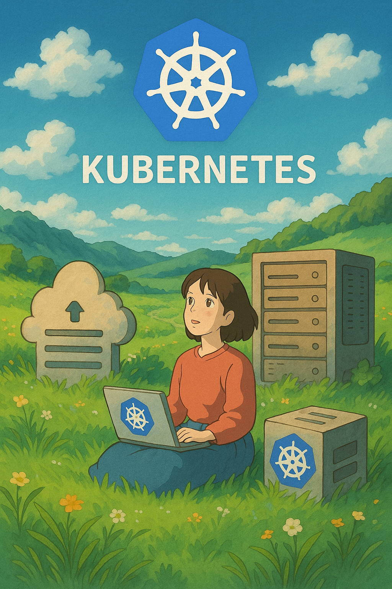

  

<!--more-->

Kubernetes 作為一個 container orchestration  是一個非常強大的平台  
但因為設計因素,造成他在安裝就有一定程度的麻煩  
也許因此原因, 跟 linux 一樣有各種 distribution 的出現   

這邊快速探討下幾個 distribution  

### Minikube
Minikube 是一個輕量級的 Kubernetes 實作，主要用於本地開發和測試。它可以在筆記型電腦上輕鬆運行單節點 Kubernetes 集群，支援多種虛擬化驅動（如 Docker, VirtualBox, KVM 等）。  
Kubernetes 官方 tutorials 就是採用 Minikube  
**優點:**
*   **易於安裝和使用:** 快速啟動本地 Kubernetes 環境。
*   **多驅動支援:** 靈活選擇虛擬化技術。
*   **本地開發友好:** 適合學習和測試 Kubernetes 功能。

**缺點:**
*   **單節點限制:** 不適合模擬多節點生產環境。
*   **資源消耗:** 即使是單節點，也需要一定的計算資源。
*   **網路資源:** docker overlap network。

### Kind (Kubernetes in Docker)
Kind 是一個使用 Docker 容器作為節點來運行本地 Kubernetes 集群的工具。它非常適合在 CI/CD 環境中進行 Kubernetes 測試，或者在本地快速搭建多節點集群。
與 Minikube 差不多  
**優點:**
*   **輕量級多節點:** 可以在單一主機上模擬多個 Kubernetes 節點。
*   **CI/CD 整合:** 非常適合自動化測試流程。
*   **快速啟動:** 基於 Docker 容器，啟動速度快。

**缺點:**
*   **依賴 Docker:** 必須安裝 Docker 才能使用。
*   **網路複雜性:** 容器內的網路配置可能比 Minikube 稍微複雜。
*   **網路資源:** docker overlap network。

### k3s
k3s 是一個輕量級的 Kubernetes 發行版，由 Rancher Labs 開發，專為邊緣計算、物聯網和 CI/CD 環境設計。它將 Kubernetes 的核心組件打包成一個單一的二進位文件，大大減少了資源佔用。  

**優點:**
*   **極致輕量:** 資源消耗極低，適合資源受限的環境。
*   **快速部署:** 安裝和啟動速度非常快。
*   **單一二進位文件:** 易於分發和管理。

**缺點:**
*   **功能精簡:** 為了輕量化，移除了一些企業級功能。
*   **社群規模:** 相較於標準 Kubernetes，社群規模較小。

### MicroK8s
MicroK8s 是由 Canonical (Ubuntu 的開發商) 開發的一個輕量級、零操作的 Kubernetes 發行版。它提供了一鍵安裝和內建的附加組件（如 DNS, Dashboard, Registry 等），非常適合開發者和小型部署。  

**優點:**
*   **一鍵安裝:** 部署過程非常簡單。
*   **內建附加組件:** 開箱即用，無需額外配置。
*   **快照和高可用性:** 提供了一些生產級功能。

**缺點:**
*   **Ubuntu 優先:** 在 Ubuntu 系統上表現最佳，其他系統可能需要額外配置。
*   **資源消耗:** 相較於 k3s，可能稍微高一些。

## conclusion
k3s 簡易的架構 非常適合用在個人學習/測試  
k8s 安裝一個 node 可能 10mins 起跳  
使用 k3s 只須 1mins  
另外後續升級維護也十分方便  
  
也因其輕量化 適合使用在 CICD 環境  
另外也是面向 prouduction ready  
所以在正式環境使用也完全沒有問題  
十分推薦使用  

而 Minikube 這種使用 docker 模擬的  
除了效率不佳外, 也因為其 network 會被 docker 包一層(overlap)  
導致一些 k8s 網路相關的行為會不一樣,個人非常不建議使用  

