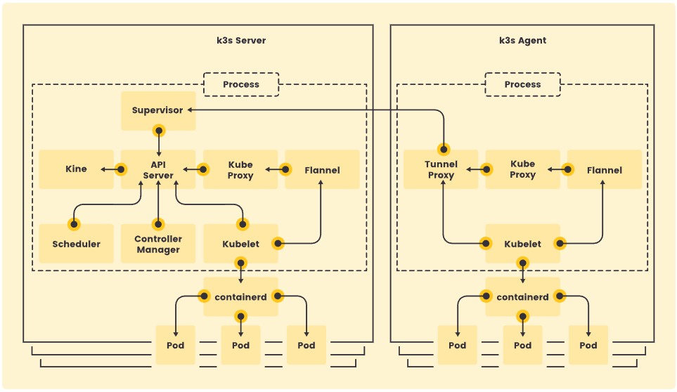
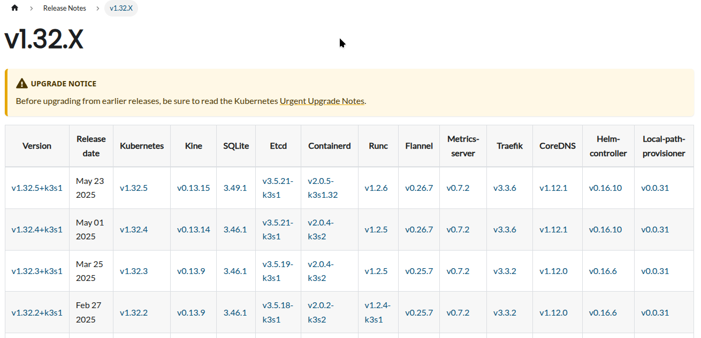

  

<!--more-->

## introduction
節錄自官網
**Perfect for Edge**
K3s is a highly available, certified Kubernetes distribution designed for production workloads in unattended, resource-constrained, remote locations or inside IoT appliances.

**Simplified & Secure**
K3s is packaged as a single <70MB binary that reduces the dependencies and steps needed to install, run and auto-update a production Kubernetes cluster.

**Optimized for ARM**
Both ARM64 and ARMv7 are supported with binaries and multiarch images available for both. K3s works great on something as small as a Raspberry Pi to an AWS a1.4xlarge 32GiB server.

其中幾個重點  
support HA  
support cluster  
single binary easy maintain  
low resource usage  
not running inside docker, 環境接近原生 k8s  

### architecture

先看官方的架構圖

首先分成 k3s server,k3s agent  
- k3s server: control-plan node  
- k3s agent: worker node  

與 k8s 不同的點  
k3s server default 不會有 taints, pod 是可以直接 schedule 進去

再來是為了方便安裝  
不像 k8s 你要自己東拼西湊  
k3s 預設就會幫你把 container run-time, cni .... 一併處理好  
詳細包了什麼  可以參考 release note

當中有些元件是可以更換的
- container-runtime: https://docs.k3s.io/advanced#alternative-container-runtime-support
- cni