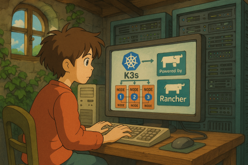

  

<!--more-->
這一篇將深入探討如何在 K3s 叢集中整合進階元件，以提升其功能性、網路效能、負載平衡能力以及持久化儲存的彈性。K3s 雖然輕量，但在生產環境中，往往需要更強大的網路、負載平衡和儲存解決方案。本篇將介紹如何導入以下關鍵元件，將 K3s 叢集從基礎配置升級為功能更完善、效能更優異的進階部署：

-   **CNI (Container Network Interface): Cilium (Without kube-proxy)**：取代 K3s 預設的 Flannel，提供基於 eBPF 的高性能網路和安全策略。
-   **Ingress Controller: HAProxy Ingress**：取代 K3s 預設的 Traefik，提供更高效、靈活的外部流量路由和負載平衡。
-   **CSI (Container Storage Interface): Longhorn**：為叢集提供分佈式持久化儲存，確保應用程式數據的高可用性和持久性。


## Component Introduction (元件介紹)

### CNI: Cilium (Without kube-proxy)

Cilium 是一個基於 **eBPF (extended Berkeley Packet Filter)** 技術的開源軟體，專為 Kubernetes 叢集提供高性能的網路、安全和可觀察性。相較於傳統的 CNI 解決方案，Cilium 能夠在 Linux 核心中直接處理網路封包，從而實現更低的延遲和更高的吞吐量。

**Cilium Without kube-proxy 的優勢**：

傳統上，Kubernetes 使用 `kube-proxy` 來處理服務的負載平衡和網路轉發。然而，Cilium 能夠利用 eBPF 直接在 Linux 核心中處理這些功能，從而繞過 `kube-proxy`。這樣做的好處包括：

*   **更高的性能**：eBPF 允許在核心層面進行高效的封包處理，減少了使用者空間和核心空間之間的上下文切換，顯著降低了網路路徑中的延遲。
*   **更低的資源消耗**：無需運行額外的 `kube-proxy` 進程，減少了叢集節點上的資源佔用。
*   **更強大的可觀察性**：eBPF 提供了對網路流量更深入的洞察，可以實時監控和分析網路行為，有助於故障排除和性能優化。
*   **更靈活的網路策略**：Cilium 能夠實現更複雜和細緻的網路安全策略，例如基於應用層協議 (L7) 的策略，提供更精細的流量控制。
*   **簡化網路堆疊**：移除 `kube-proxy` 可以簡化 Kubernetes 的網路堆疊，減少潛在的配置複雜性和故障點。

### Ingress Controller: HAProxy Ingress

HAProxy Ingress 是一個基於高性能 HAProxy 的 Kubernetes Ingress Controller。Ingress Controller 負責將外部流量路由到叢集內部的服務，是將應用程式暴露給外部世界的關鍵組件。HAProxy 以其高性能、高可靠性和靈活性而聞名，作為 Ingress Controller，它能夠提供：

*   **高效的負載平衡**：支持多種負載平衡算法（如 Round Robin, Least Connections 等），確保流量均勻分佈到後端服務。
*   **SSL/TLS 終止**：在 Ingress 層處理加密和解密，減輕後端服務的負擔，並集中管理憑證。
*   **基於內容的路由**：根據請求的 URL 路徑、Host 名稱、HTTP 頭等信息將流量導向不同的服務，實現靈活的流量分發。
*   **高級流量管理**：支持 URL 重寫、添加自定義 HTTP 頭、請求限速、身份驗證等高級功能，滿足複雜的應用需求。
*   **穩定性和可靠性**：HAProxy 作為業界領先的負載平衡器，提供了極高的穩定性和可靠性，適合生產環境使用。

相較於 K3s 預設的 Traefik，HAProxy Ingress 在某些場景下可能提供更精細的控制和更強大的企業級功能，尤其是在需要高度定制化負載平衡策略時。

### CSI: Longhorn

Longhorn 是一個輕量級、可靠且易於使用的 Kubernetes 分佈式區塊儲存系統。它由 Rancher Labs 開發，並作為 CNCF (Cloud Native Computing Foundation) 沙箱項目。Longhorn 通過 CSI 接口為 Kubernetes 提供持久化儲存，允許有狀態應用程式在叢集中動態地請求和使用儲存空間。

**Longhorn 的主要特點**：

*   **分佈式塊儲存**：將多個節點的本地儲存空間聚合起來，形成一個分佈式儲存池，為 Pod 提供持久卷。
*   **快照和備份**：支持數據的即時快照、增量備份到 S3 或 NFS，以及方便的數據恢復功能，確保數據安全。
*   **災難恢復**：提供跨節點的數據複製和自動故障轉移，當節點或磁碟發生故障時，數據仍可訪問，保證應用程式的連續性。
*   **易於部署和管理**：Longhorn 可以通過 Helm Chart 輕鬆部署到 Kubernetes 叢集，並提供直觀的 Web UI 界面進行管理和監控。
*   **版本 2 (v2) 數據引擎**：Longhorn 官方在 v1.5.0 版本引入了基於 SPDK (Storage Performance Development Kit) 的 v2 數據引擎。此引擎旨在大幅提升儲存性能，解決了早期版本可能存在的性能瓶頸，使其更適合對 I/O 性能有較高要求的應用。

**相關連結**：

*   [Kubernetes Storage Comparison](https://kubedo.com/kubernetes-storage-comparison/)
*   [Kubernetes Storage Performance Comparison: Rook-Ceph and Piraeus Datastore (Linstor)](https://itnext.io/kubernetes-storage-performance-comparison-rook-ceph-and-piraeus-datastore-linstor-e9bc2859a8f0)
*   [Longhorn v2 Data Engine Performance](https://longhorn.io/docs/1.6.2/v2-data-engine/performance/)

## Start Installation (開始安裝)
本節將引導您完成 K3s 叢集與上述進階元件的安裝過程。  
並且 mirror registry 方式安裝來大幅節省 pull image bandwidth  

### Prerequisites (前置準備)

在開始安裝之前，請確保您已完成以下準備工作：  

*   **作業系統**：所有節點均使用 Ubuntu 24.04 LTS。
*   **節點規劃**：
    *   3 個 K3s Server 節點 (Master)：IP 範圍 192.168.56.101 ~ 192.168.56.103
    *   1 個 K3s Agent 節點 (Worker)：IP 192.168.56.104
    *   1 個 VIP (Virtual IP) 用於 K3s Server 高可用：IP 192.168.56.100
*   **網路連通性**：所有節點之間必須能夠互相通訊。
*   **SSH 訪問**：確保可以從您的控制機器 SSH 訪問所有節點。
*   **基礎工具**：所有節點上需安裝 `curl`,`wget` 和 `sudo`。

### step

1. 利用之前的 vagrant 起 4 個 node [vagrant-introduction](https://blog.owanio1992.cloudns.nz/posts/20250612_vagrant-introduction/)  
2. 設定 [keepalived](https://blog.owanio1992.cloudns.nz/posts/20250613_k3s-install-advance-1/#1-%E5%AE%89%E8%A3%9D-keepalived)   
3. Enabling Registry Mirroring  
https://docs.k3s.io/installation/registry-mirror#enabling-registry-mirroring

這功能將每個 k3s node 成為 mirror registry  
藉此節省 pull image 所需的 bandwidth  
in each node config  
```bash
sudo mkdir -p /etc/rancher/k3s/
sudo tee /etc/rancher/k3s/registries.yaml <<EOF
mirrors:
  "*":
EOF
```

Manually download k3s   
```bash
cd /tmp/
wget https://github.com/k3s-io/k3s/releases/download/v1.32.5%2Bk3s1/k3s
chmod +x k3s

# copy to node (repeat node1~4)
scp k3s 192.168.56.101:/tmp
```

Manually download cilium cli   

```bash
CILIUM_CLI_VERSION=$(curl -s https://raw.githubusercontent.com/cilium/cilium-cli/main/stable.txt)
CLI_ARCH=`dpkg --print-architecture`
if [ "$(uname -m)" = "aarch64" ]; then CLI_ARCH=arm64; fi
curl -L --fail --remote-name-all https://github.com/cilium/cilium-cli/releases/download/${CILIUM_CLI_VERSION}/cilium-linux-${CLI_ARCH}.tar.gz{,.sha256sum}
sha256sum --check cilium-linux-${CLI_ARCH}.tar.gz.sha256sum
sudo tar xzvfC cilium-linux-${CLI_ARCH}.tar.gz /tmp
rm cilium-linux-${CLI_ARCH}.tar.gz{,.sha256sum}
scp cilium 192.168.56.101:/tmp
```


4. install first server node  
因為我們要改用 cilium 參數所以配合調整參數  
https://docs.cilium.io/en/latest/installation/k3s/  
```bash
# 在第一個伺服器節點上執行 (e.g., node1)
sudo cp /tmp/k3s /usr/local/bin/k3s
sudo cp /tmp/cilium /usr/local/bin/cilium

export INSTALL_K3S_VERSION=v1.32.5+k3s1
export INSTALL_K3S_EXEC="server \
--disable=traefik \
--write-kubeconfig-mode 644 \
--cluster-init \
--tls-san=192.168.56.100 \
--flannel-backend=none \
--disable-network-policy \
--embedded-registry \
--disable-kube-proxy"
curl -sfL https://get.k3s.io | sh -s -

# get token (use later)
sudo cat /var/lib/rancher/k3s/server/node-token
```

5. setup k3s access
這邊做一些調整 讓平常 access k3s 會輕鬆些  
```bash
mkdir $HOME/.kube
sudo cp /etc/rancher/k3s/k3s.yaml $HOME/.kube/config
sudo chown $(id -u):$(id -g) $HOME/.kube/config

tee -a ~/.bashrc <<EOF
source <(k3s kubectl completion bash)
alias kubectl="k3s kubectl"
alias k="k3s kubectl"
complete -o default -F __start_kubectl k
EOF

source ~/.bashrc
```

這時 `k get node ` 會看到 STATUS: NotReady  
這是因為我們還沒安裝 CNI 導致, 為正常現象  
```bash
$ k describe node node1 
Conditions:
  Type             Status  LastHeartbeatTime                 LastTransitionTime                Reason                       Message
  ----             ------  -----------------                 ------------------                ------                       -------
  EtcdIsVoter      True    Sat, 14 Jun 2025 01:35:17 +0000   Sat, 14 Jun 2025 01:25:17 +0000   MemberNotLearner             Node is a voting member of the etcd cluster
  MemoryPressure   False   Sat, 14 Jun 2025 01:35:32 +0000   Sat, 14 Jun 2025 01:25:09 +0000   KubeletHasSufficientMemory   kubelet has sufficient memory available
  DiskPressure     False   Sat, 14 Jun 2025 01:35:32 +0000   Sat, 14 Jun 2025 01:25:09 +0000   KubeletHasNoDiskPressure     kubelet has no disk pressure
  PIDPressure      False   Sat, 14 Jun 2025 01:35:32 +0000   Sat, 14 Jun 2025 01:25:09 +0000   KubeletHasSufficientPID      kubelet has sufficient PID available
  Ready            False   Sat, 14 Jun 2025 01:35:32 +0000   Sat, 14 Jun 2025 01:25:09 +0000   KubeletNotReady              container runtime network not ready: NetworkReady=false reason:NetworkPluginNotReady message:Network plugin returns error: cni plugin not initialized
```


6. install cilium  
[doc](https://docs.cilium.io/en/stable/installation/k3s/)  

```bash
# install CNI
cilium install \
  --version v1.17.4 \
  --set=ipam.operator.clusterPoolIPv4PodCIDRList="10.42.0.0/16" \
  --set kubeProxyReplacement=true \
  --set k8sServiceHost=192.168.56.100 \
  --set k8sServicePort=6443

# Validate
k -n kube-system get cm cilium-config -o yaml  | grep kube-proxy-replacement
k -n kube-system exec ds/cilium -- cilium-dbg status | grep KubeProxyReplacement
cilium status --wait

# run test 
cilium connectivity test

# cleanup 
kubectl delete ns cilium-test
```

7. install helm  
helm 是一個 k8s 的 manifest manager  
之後再介紹, 這裡先直接開始使用  
```bash
curl https://raw.githubusercontent.com/helm/helm/main/scripts/get-helm-3 | bash
```

8. install longhorn
```bash
helm repo add longhorn https://charts.longhorn.io
helm repo update
helm install longhorn longhorn/longhorn --namespace longhorn-system --create-namespace --version 1.9.0
```


9. install haproxy
```bash
helm repo add haproxytech https://haproxytech.github.io/helm-charts
helm repo update
helm install haproxy-kubernetes-ingress haproxytech/kubernetes-ingress \
  --create-namespace \
  --namespace haproxy-controller
```

10. install second,third server node  
```bash
# 在第二個和第三個伺服器節點上執行 (e.g., node2, node3)

sudo cp /tmp/k3s /usr/local/bin/k3s
sudo cp /tmp/cilium /usr/local/bin/cilium

export INSTALL_K3S_VERSION=v1.32.5+k3s1
export INSTALL_K3S_EXEC="server \
  --disable=traefik \
  --write-kubeconfig-mode 644 \
  --server https://192.168.56.100:6443 \
  --tls-san=192.168.56.100 \
  --flannel-backend=none \
  --disable-network-policy \
  --embedded-registry \
  --disable-kube-proxy"
export K3S_TOKEN=<從第一個伺服器節點獲取的令牌>
curl -sfL https://get.k3s.io | sh -s -
```

7. install agent node  
```bash
sudo cp /tmp/k3s /usr/local/bin/k3s

export INSTALL_K3S_VERSION=v1.32.5+k3s1
export INSTALL_K3S_EXEC="agent \
  --server https://192.168.56.100:6443"
export K3S_TOKEN=<從第一個伺服器節點獲取的令牌>
curl -sfL https://get.k3s.io | sh -s -
```

以上 一個基本功能完整的 k3s cluster 就建起來了  
對比安裝 k8s cluster 可是簡單不少  

