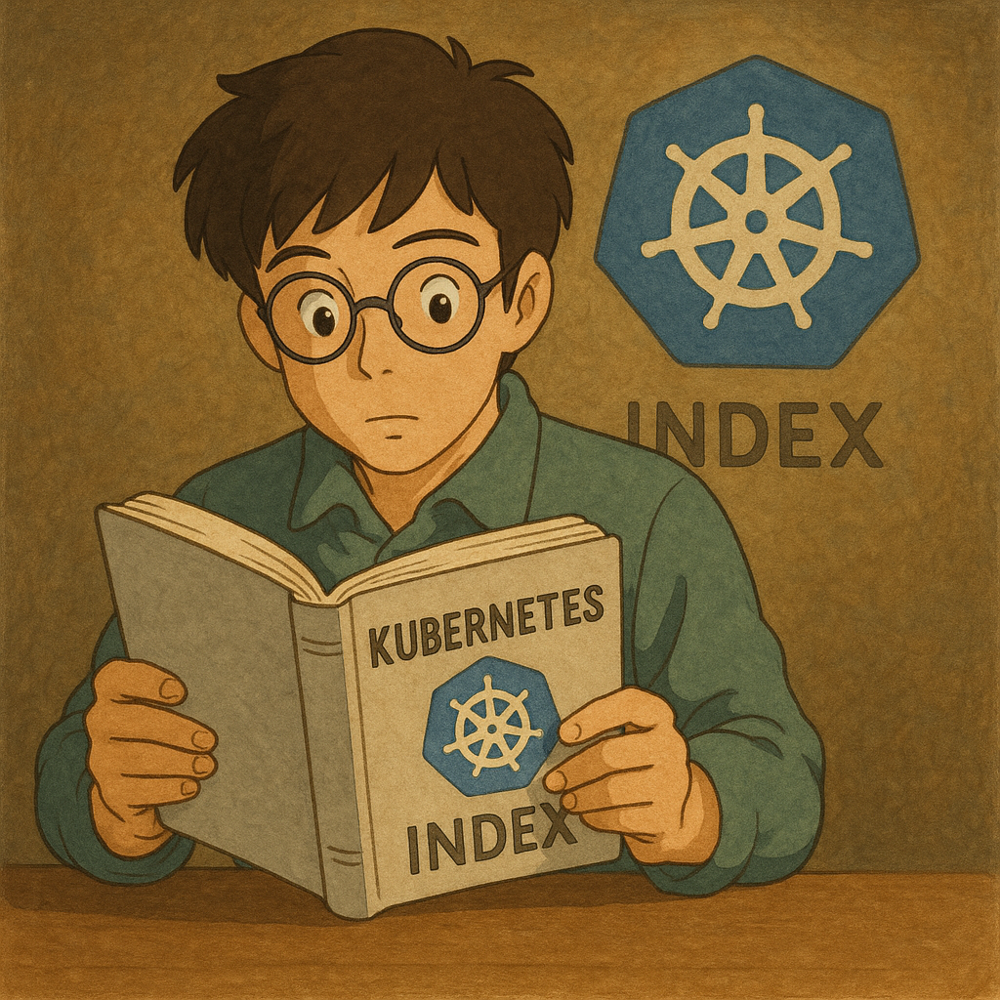

  

<!--more-->

## prologue
k8s(kubernetes) 是一個容器執行平台  
誕生於 google  
由於其本身就是 for 大型環境使用, 其功能非常多樣  
一般要上手屬實不容易  
而也許又出自 google 的手上, 其 doc 還真不是普通的易懂  
本系列的誕生有幾個目的 
* 為了能讓自己能夠掌握大部分功能:  
  等於逼自己學習啦  

* 且培養閱讀 official doc 能力:  
  k8s 功能非常多, 坊間書籍可能不會包含所有功能   
  且要等到出書, 都不知道是幾個月後的事了  
  能夠立即了解 new information  是非常重要的  

* 官方 doc 排序超級鳥:  
  於果你跟我一樣照著 k8s 官方的排序閱讀  
  你應該會跟一樣一頭霧腦的  
  以下順序經過我重新調整過  
  希望能夠讓讀者們在學習 k8s 時能夠得心應手  
  
  
---
在本系列開始前  
先給大家一個觀念  
k8s 跟 docker 都需要使用 container runtime 去執行容器  
而他們基本都使用 containerd  
換句話說 在一定程度上是很像的  
只是 k8s 是 for 大型環境使用  
docker 偏向小型環境  
什麼意思呢？  
舉例來說  
如果你今天只是要載 2~3 位朋友出門  
你可能會開著自排小客車出門: 你只要會打 D 檔/踩油門/踩煞車  
  
如果你今天只是要載 10~20 位朋友出門  
你會需要開大客車: 你得學會 手動排檔/車輛保養/轉彎半徑...及其餘知識    
  
如果你不會開小客車, 那開大客車就不用想了 因為你沒有基本能力  
就跟台灣考駕照制度一樣  
考大客車駕照前 必須先考小型車駕照, 這是基本門檻  
  
回到這裡  
若還沒了解 docker 的話, 雖然沒人會阻止你學習 k8s  
但一定會學得很痛苦, 這裡一定不會再去講 container 的基本知識  
而且基本工太差, 很容易就學歪掉  
請務必把學習 docker 當成學習 k8s 的基本門檻  
等 docker 學的差不多後, 再回來閱讀此系列  

## index

### beginner 
這個類別是建議所有人都該學會 k8s 的知識  

- [Concepts - Overview](/posts/20250616_k8s-doc-reading-concepts-overview/)
- [Concepts - Overview: Kubernetes Components](/posts/20250616_k8s-doc-reading-concepts-cluster-architecture/)
- Concepts - Cluster Architecture
- Concepts - Cluster Architecture: Node 
- Concepts - Cluster Architecture: Communication between Nodes and the Control Plane  
- Concepts - Workloads
- Concepts - Workloads - Pods
- Concepts - Workloads: Managing Workloads
- Concepts - Services, Load Balancing, and Networking
- Concepts - Services, Load Balancing, and Networking: Service
- Concepts - Services, Load Balancing, and Networking: Ingress,Ingress Controllers
- Concepts - Services, Load Balancing, and Networking: DNS for Services and Pods
- Concepts - Storage: Volumes
- Concepts - Storage: Persistent Volumes
- Concepts - Storage: Storage Classes
- Concepts - Storage: Dynamic Volume Provisioning
- Concepts - Configuration - Configuration Best Practices
- Concepts - Configuration - ConfigMaps
- Concepts - Configuration - Secrets
- Concepts - Configuration - Liveness, Readiness, and Startup Probes
- Concepts - Configuration - Resource Management for Pods and Containers
- Concepts - Security
- Concepts - Security: Service Accounts
- Concepts - Scheduling, Preemption and Eviction: Kubernetes Scheduler
- Concepts - Scheduling, Preemption and Eviction: Assigning Pods to Nodes
- Concepts - Scheduling, Preemption and Eviction: Taints and Tolerations
- Concepts - Cluster Administration: Node Shutdowns
- Concepts - Cluster Administration: Node Autoscaling
- Concepts - Overview: Objects In Kubernetes
- Getting started - Learning environment

- Getting started - Container Runtimes
- Administer a Cluster: Administration with kubeadm
- Reference - Command line tool (kubectl): Introduction to kubectl
- Reference - Command line tool (kubectl): kubectl Quick Reference
- Getting started - Installing Kubernetes with deployment tools

### intermediate
- Concepts - Workloads: Autoscaling Workloads
- Concepts - Workloads - Pods: Pod Lifecycle
- Concepts - Workloads - Pods: Init Containers ?? Concepts - Containers - Container Lifecycle Hooks
- Concepts - Workloads - Pods: Sidecar Containers
- Concepts - Services, Load Balancing, and Networking: Gateway API
- Concepts - Services, Load Balancing, and Networking: EndpointSlices
- Concepts - Services, Load Balancing, and Networking: Network Policies
- Concepts - Services, Load Balancing, and Networking: Topology Aware Routing

- Concepts - Security: Cloud native information security 
- Concepts - Security: Role Based Access Control Good Practices
- Concepts - Security: Good practices for Kubernetes Secrets

- Concepts - Cluster Architecture: Kubernetes Self-Healing
- Getting started - Production environment
### advanced
- Concepts - Workloads - Pods: Pod Quality of Service Classes
- Concepts - Workloads - Pods: User Namespaces
- Concepts - Workloads - Pods: Downward API

- Concepts - Storage - Volumes: Projected Volumes
- Concepts - Storage - Volumes: Persistent Volumes
- Concepts - Storage - Volumes: Volume Attributes Classes
- Concepts - Storage - Volumes: Volume Snapshots
- Concepts - Storage - Volumes: Volume Snapshot Classes
- Concepts - Storage - Volumes: CSI Volume Cloning
- Concepts - Storage - Volumes: Storage Capacity
- Concepts - Storage - Volumes: Node-specific Volume Limits

- Concepts - Configuration - Organizing Cluster Access Using kubeconfig Files
- Concepts - Security: Pod Security Standards
- Concepts - Security: Pod Security Admission
- Concepts - Security: Multi-tenancy
- Concepts - Security: Linux kernel security constraints for Pods and containers

- Concepts - Workloads - Pods: Disruptions

- Administer a Cluster: Overprovision Node Capacity For A Cluster

- Getting started - Best practices: Considerations for large clusters
- Getting started - Best practices: Running in multiple zones
- Getting started - Best practices: Validate node setup
- Getting started - Best practices: Enforcing Pod Security Standards
- Getting started - Best practices: PKI certificates and requirements

