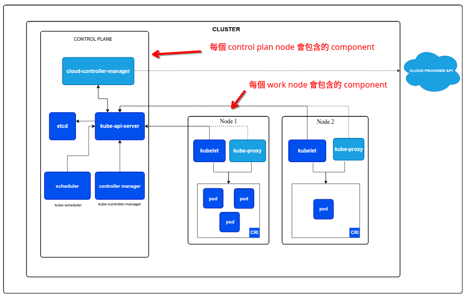

  

<!--more-->

[doc link](https://kubernetes.io/docs/concepts/overview/components/)  

先對 k8s 架構有一定程度的了解後  
會更容易上手 k8s  
首先 k8s 本身就是設計成 cluster 模式  
會先把 node 分成兩大 node group

- Control plane: 負責執行 k8s cluster 管理元件  
  一般來說一個 production ready cluster 會準備 3 個 Control plane node
  預設不會執行 k8s 本身以外的 container
- worker: 執行我們 user workloads container

## component 介紹
以下我認為大概知道即可  
除了在 debug cluster issue 外  
一般在操作其實不太會碰到  

### kube-apiserver
The API server is a component of the Kubernetes control plane that exposes the Kubernetes API. The API server is the front end for the Kubernetes control plane.

The main implementation of a Kubernetes API server is kube-apiserver. kube-apiserver is designed to scale horizontally—that is, it scales by deploying more instances. You can run several instances of kube-apiserver and balance traffic between those instances.

API server 是負責 component /operator 之間溝通的橋樑  
不管是機器還是人都是要照著 Kubernetes API 的規範溝通  
如果連不上 API server 意味著失去對 cluster 的控制能力

### etcd 
Consistent and highly-available key value store used as Kubernetes' backing store for all cluster data.

If your Kubernetes cluster uses etcd as its backing store, make sure you have a back up plan for the data.

You can find in-depth information about etcd in the official documentation.

簡單來說就是 k8s 的資料庫  

### kube-scheduler
Control plane component that watches for newly created Pods with no assigned node, and selects a node for them to run on.

Factors taken into account for scheduling decisions include: individual and collective resource requirements, hardware/software/policy constraints, affinity and anti-affinity specifications, data locality, inter-workload interference, and deadlines.

我們實際在使用 k8s 時, 會告訴他我們的期望執行 container 的條件  
比如說 cpu/memory 需要多少, 該執行在什麼 cpu architecture 上, 甚至是 node type (有無 GPU 之類的)   

scheduler 負責根據我們的設定 編排 container 在符合條件的 work node 上執行   

### kube-controller-manager
Control plane component that runs controller processes.

Logically, each controller is a separate process, but to reduce complexity, they are all compiled into a single binary and run in a single process.

There are many different types of controllers. Some examples of them are:

Node controller: Responsible for noticing and responding when nodes go down.
Job controller: Watches for Job objects that represent one-off tasks, then creates Pods to run those tasks to completion.
EndpointSlice controller: Populates EndpointSlice objects (to provide a link between Services and Pods).
ServiceAccount controller: Create default ServiceAccounts for new namespaces.
The above is not an exhaustive list.

簡單來說  就是 manager   

### cloud-controller-manager 
這是 option component  
除非你有用 cloud provider (公有雲/私有雲)  
才有這 component,  但基本上 cloud provider 舉例 EKS  
不會讓你接觸到 control-plane  
所以你也不用 care

### kubelet
An agent that runs on each node in the cluster. It makes sure that containers are running in a Pod.

Kubelet watches for PodSpecs provided through various mechanisms and ensures that the containers described in those PodSpecs are running and healthy. It does not manage containers that were not created by Kubernetes.

簡單來說，kubelet 是每個 worker node 上的主要代理程式。它負責確保 Pod 中的容器正常運行。  
它會監控 API server 傳來的 Pod 定義，並確保這些 Pod 及其容器在節點上被正確地啟動、運行和維護。  

### kube-proxy
kube-proxy is a network proxy that runs on each node in your cluster, implementing part of the Kubernetes Service concept.

kube-proxy maintains network rules on nodes. These network rules allow network communication to your Pods from network sessions inside or outside of your cluster.

kube-proxy 負責處理 Service 的網路代理，它會根據 Service 的定義，在每個節點上維護網路規則（例如 iptables 或 IPVS 規則），以實現 Service 的負載平衡和網路轉發，確保流量能夠正確地導向到後端的 Pod。  

### Container runtime 
A fundamental component that empowers Kubernetes to run containers effectively. It is responsible for managing the execution and lifecycle of containers within the Kubernetes environment.

Kubernetes supports container runtimes such as containerd, CRI-O, and any other implementation of the Kubernetes CRI (Container Runtime Interface).

就是負責執行的 container 的 component   
基本上建議使用 containerd  

## Addons

提供 cluster features 
基本上這些 pod 會長在 namespace `kube-system`  
關於 namespace, 後面再解釋 

### Cluster DNS
Cluster DNS is a DNS server, in addition to the other DNS server(s) in your environment, which serves DNS records for Kubernetes services.

k8s 透過 DNS 來讓 container 找到彼此  
因此會有個 DNS server 在 cluster 內

### Web UI (Dashboard)
Dashboard is a general purpose, web-based UI for Kubernetes clusters. It allows users to manage and troubleshoot applications running in the cluster, as well as the cluster itself.

預設不會安裝
讓大家方便管理的 Dashboard  
不過個人覺得看看就好  
因為很陽春  一般會採用其他 solution  

### Container resource monitoring
k8s 沒有 implement 先略過  

### Cluster-level Logging 
k8s 沒有 implement 先略過  

### Network plugins
k8s 沒有 implement  
但缺他不可
簡單來說每個 container 都會有存取網路的需求   
而這必須夠過 CNI(container network interface)  

k8s 跟 docker 不同的是 
docker 不需要額外設定, contianer 就有網路功能  

k8s 必須再額外安裝 CNI 才行  
不過因此 CNI 會有五花八門的選擇  
各自有各自的好壞  
後面會再介紹  

## Architecture variations 
簡單來說 k8s 的安裝其實可以根據需求產生變化  
舉例來說 control-plane 也能執行 user workloads  

### Traditional deployment
Control plane components run directly on dedicated machines or VMs, often managed as systemd services.

畢竟也是要有人管理 k8s 的運作  
通常透過 systemd  

### Static Pods
Control plane components are deployed as static Pods, managed by the kubelet on specific nodes. This is a common approach used by tools like kubeadm.

這裡第一次出現 pod 這個詞  
說明一下 pod 是 k8s 最小部屬單位 是一個 container 的 group    
讓 多個 container 能夠共用 network/volume resource  
後面會再詳細說明  

而 Static Pods 則是相當特別的 pod  
其他的 pod 都是透過 scheduler 編排後透過決定是否交給 kubelet 啟動  

Static Pods 則是跳過 scheduler, kubelet 直接啟動  
通常都是執行系統 component  
我們一般不會使用 Static Pods  