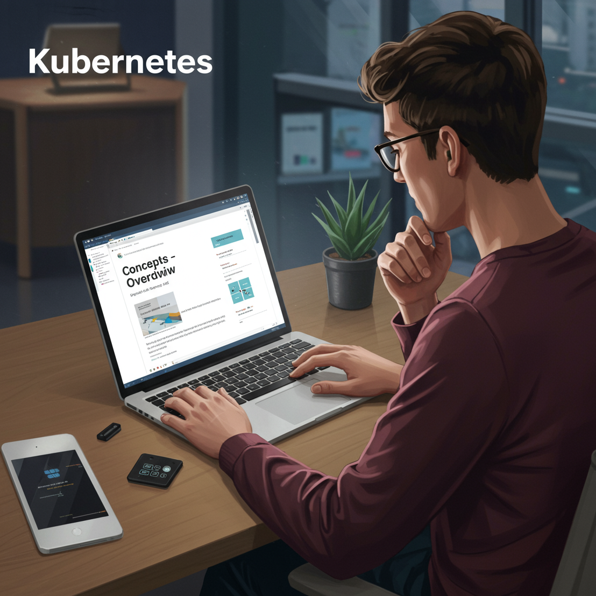

  

<!--more-->
[doc link](https://kubernetes.io/docs/concepts/overview/)  
為什麼有 docker 之後, 又要有 k8s 呢？ 
簡單來說 docker 在小環境跑起來沒問題  
但是當要在中大環境執行時, 就開始面臨管理上的困難  

在 doc 一開始 就直接表明 k8s 具有以下特性  
- extensible: 
  k8s 具有第三方擴充能力, 功能不會受限官方所開發的項目, 這樣 k8s 帶來無窮潛力
- declarative configuration: 
  k8s 採用 config 方式運作, 具有 reusable,easier to manage and understand 特點  
  也可以大幅降低 OP 的手誤

- automation:
  要管理成千上萬的 container, 自動化將是必要的
  否則什麼都人工肯定會造成很大的負擔
  其中包含 scaling and failover 

## what Kubernetes provides
以下先貼上官方原文, 再做中文說明  
中文部份會再加上我個人的補充  

### Service discovery and load balancing: 
Kubernetes can expose a container using the DNS name or using their own IP address. If traffic to a container is high, Kubernetes is able to load balance and distribute the network traffic so that the deployment is stable.
  
  在 docker 中, 很容易遇到的挑戰是 container 跟 container 之間如何溝通  
  在一對一中 你要首先知道如何找到對方  
  在多對多中(replica) 你還要知道怎們進行 loadbalance(負載平衡)  
  因此一般在 docker 中你會需要借助外部的 loadbalancer 去完成

  在 k8s cluster 中 則是提供了 DNS name 的方式讓 container 能夠輕易找到對方的 endpoint(位置)  
  另外 k8s 也支援 loadbalance, 在有 replica 的情況也能自動做 loadbalance 而不須人為介入  
  

### Storage orchestration 
Kubernetes allows you to automatically mount a storage system of your choice, such as local storages, public cloud providers, and more.
  
  k8s 支援不同的 storage 來源及設定, 包括類型(NFS,iSCSI,local), 設定(size,IOPS...)   
  讓不同需求的 container 可以使用不同的 storage 來源  
  舉例來說我新增設定檔 SSD, HDD  
  讓 cluster 內部的 container 可以根據需求使用 SSD or HDD 的 storage  

### Automated rollouts and rollbacks 
You can describe the desired state for your deployed containers using Kubernetes, and it can change the actual state to the desired state at a controlled rate. For example, you can automate Kubernetes to create new containers for your deployment, remove existing containers and adopt all their resources to the new container.
  
  你可以讓 k8s 幫你完成 滾動升級(rolling upgrade) 跟退板  
  你不需要人工的更新 container  
  如果你有設定 health check  也能進一步達到金絲雀部屬(canery deploy)  
  讓每次的 release 更加穩定 & graceful  

### Automatic bin packing 
You provide Kubernetes with a cluster of nodes that it can use to run containerized tasks. You tell Kubernetes how much CPU and memory (RAM) each container needs. Kubernetes can fit containers onto your nodes to make the best use of your resources.
  
  可以理解為 k8s 會根據你的設定自動將 container 執行在有足夠 computing resource 的節點上  
  如果資源無法滿足, 則不會行 container  
  這可以大幅度的避免 container 長在非常忙碌的節點上, 造成忙上加忙的窘境  

### Self-healing 
Kubernetes restarts containers that fail, replaces containers, kills containers that don't respond to your user-defined health check, and doesn't advertise them to clients until they are ready to serve.

  k8s 能自動幫你找到異常的 container 進行暫時隔離/更換  
  並且避免外部流量持續進到異常的 container  

### Secret and configuration management 
Kubernetes lets you store and manage sensitive information, such as passwords, OAuth tokens, and SSH keys. You can deploy and update secrets and application configuration without rebuilding your container images, and without exposing secrets in your stack configuration.
  
  k8s 能夠協助管理 config 及資密資訊  
  避免你將機密資訊存在 container image  

### Batch execution 
In addition to services, Kubernetes can manage your batch and CI workloads, replacing containers that fail, if desired.

  可以讓 k8s 幫你進行 CI 相關的工作  
  因其 auto scale 的特性, 當用有 high loading 需求時有能發揮效益 
  
### Horizontal scaling 
Scale your application up and down with a simple command, with a UI, or automatically based on CPU usage.

  提供水平擴展功能(replica)  
  搭配 KEDA, 能夠支援多樣 trigger 來源  
  比如說 request 量變高時  

### IPv4/IPv6 dual-stack 
Allocation of IPv4 and IPv6 addresses to Pods and Services

### Designed for extensibility
 Add features to your Kubernetes cluster without changing upstream source code.

  最重要的功能  
  k8s 提供了擴充能力  
  讓別人能夠輕易提供新功能  
  而不需要等待 k8s release  
  剛剛提到的 KEDA 就是之一  
  原生的 k8s 做 auto scale 的條件有限(CPU/Memory)  
  在實務上會有其他需求,比如說 queue length  
  那需要提 PR 並等 k8s release 嗎？  不用  
  一來這樣非常曠日費時  
  而且也會讓 k8s 體積直線上升, 對他人而言用不到的功能也只是徒增 resource 消耗  
  因此能夠根據需求再擴充的能力就非常重要  

## What Kubernetes is not

直接節錄原文  
Kubernetes is not monolithic, and these default solutions are optional and pluggable. Kubernetes provides the building blocks for building developer platforms, but preserves user choice and flexibility where it is important.  
這句話很重要  在剛學 k8s 的人必須要知道的事情  
k8s 是模組化設計  
有些東西你不喜歡官方預設選項的話  你是可以更換的 比如 kube-proxy  
還有個重點  
k8s 有些東西只有提供支援  但並沒有實際 implement(比如說 ingress)  
舉例來說  
政府蓋了國道1號  任何人都可以上路  
但你必須自備汽車  

這是 k8s 很特別的點 也是很容易讓人感到困惑的點  

---

一樣先貼原文, 再以中文解釋  

### Does not limit the types of applications supported. 
  Kubernetes aims to support an extremely diverse variety of workloads, including stateless, stateful, and data-processing workloads. If an application can run in a container, it should run great on Kubernetes.

  k8s 並沒有限制你可以跑什麼樣的東西  
  language or type 都沒有  
  總之 docker 能跑得 k8s 也能跑  
  只要照著 OCI 的標準的話  就能支援  

### Does not deploy source code and does not build your application. 
Continuous Integration, Delivery, and Deployment (CI/CD) workflows are determined by organization cultures and preferences as well as technical requirements.

  與 docker 不同, k8s 不提供 build container image 的能力  
  不過前面說過 k8s 有擴充能力 > 所以你想的話也是可以搞出來的  

### Does not provide application-level services
such as middleware (for example, message buses), data-processing frameworks (for example, Spark), databases (for example, MySQL), caches, nor cluster storage systems (for example, Ceph) as built-in services. Such components can run on Kubernetes, and/or can be accessed by applications running on Kubernetes through portable mechanisms, such as the Open Service Broker.

  簡單來說  就是只負責執行 container  
  不會提供 container 執行過程中需要的 dependenices  

### Does not dictate logging, monitoring, or alerting solutions. 
It provides some integrations as proof of concept, and mechanisms to collect and export metrics.

  沒有限制 logging/monitoring/alerting 方法  
  你可以根據組織需求變更

### Does not provide nor mandate a configuration language/system
(for example, Jsonnet).  
It provides a declarative API that may be targeted by arbitrary forms of declarative specifications.

### Does not provide nor adopt any comprehensive machine configuration, maintenance, management, or self-healing systems.

  這講的是 k8s 不會提供 node 的維護  
  所以你在各大公有雲上面會看到各自的 distribution 來讓 k8s 能夠順利執行
  
### Additionally, Kubernetes is not a mere orchestration system. 
In fact, it eliminates the need for orchestration. The technical definition of orchestration is execution of a defined workflow: first do A, then B, then C. In contrast, Kubernetes comprises a set of independent, composable control processes that continuously drive the current state towards the provided desired state. It shouldn't matter how you get from A to C. Centralized control is also not required. This results in a system that is easier to use and more powerful, robust, resilient, and extensible.

  舉例來說 我們在佈署一個 app A, 他須要先有 DB 才能夠正常執行  
  所以正常部屬流程上會是 '啟動 DB ' > '啟動 app A'  
  但在 k8s 上卻是同時啟動  並各自維護狀態  
  這樣系統才更易於使用、更強大、更穩健、更有彈性和可擴展性。  

---
以上就是 k8s 的 overview  
在大概知道 k8s 後,就能比較輕易了解每個功能他能/要做什麼了  