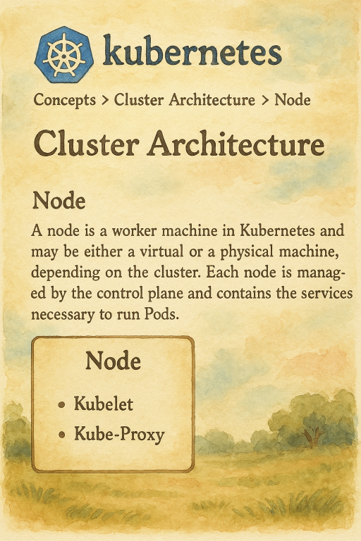

  

<!--more-->
[doc link](https://kubernetes.io/docs/concepts/architecture/nodes/)  

為避免混淆  
這裡都是在說 work node  
也就是專門在跑 user workloads 的 node  

## add worker node 

先告訴大家  
不同的 k8s distribution 會有不同的 add node 方式  

除非你是採用 原生的 k8s  
不然這邊快速了解就好

如果你是採用 cloud provider 的 k8s cluster 
要新增 node 有兩種方式  
node name 預設是 host name, 且在 k8s cluster 必須 unique 不能重複  

- self-registers  
  kubelet 啟動會自動跟 control plane 註冊
- manually add a Node  
  使用 kubectl 註冊

> kubectl: 操作 k8s 的工具, 後面會介紹


## Node status

這邊用到一些指令  
但因為還沒講 kubectl 
所以大概知道就好

```bash
# check node status
kubectl describe node
```

前面有說, kubectl 是我們對 k8s 的操作工具  
describe node 就是取得 node 的資訊  
比如說 ip, 執行在該 node 的 pod  
cpu/memory resource usage

範例  
```bash
$ k describe node node1
Name:               node1
Roles:              control-plane,etcd,master
Labels:             beta.kubernetes.io/arch=amd64
                    beta.kubernetes.io/instance-type=k3s
                    beta.kubernetes.io/os=linux
                    kubernetes.io/arch=amd64
                    kubernetes.io/hostname=node1
                    kubernetes.io/os=linux
                    node-role.kubernetes.io/control-plane=true
                    node-role.kubernetes.io/etcd=true
                    node-role.kubernetes.io/master=true
                    node.kubernetes.io/instance-type=k3s
                    p2p.k3s.cattle.io/enabled=true
Annotations:        alpha.kubernetes.io/provided-node-ip: 192.168.56.101,fd17:625c:f037:2:a00:27ff:fe94:112e
                    csi.volume.kubernetes.io/nodeid: {"driver.longhorn.io":"node1"}
                    etcd.k3s.cattle.io/local-snapshots-timestamp: 2025-06-17T07:07:56Z
                    etcd.k3s.cattle.io/node-address: 192.168.56.101
                    etcd.k3s.cattle.io/node-name: node1-0d481970
                    k3s.io/hostname: node1
                    k3s.io/internal-ip: 192.168.56.101,fd17:625c:f037:2:a00:27ff:fe94:112e
                    k3s.io/node-args:
                      ["server","--disable","traefik","--write-kubeconfig-mode","644","--cluster-init","--tls-san","192.168.56.100","--flannel-backend","none","...
                    k3s.io/node-config-hash: 3YGRMKVSKKIFXYFIXWEHZNCZIVK6HVSSOA5N7TVZOS737YFETYAA====
                    k3s.io/node-env: {}
                    node.alpha.kubernetes.io/ttl: 0
                    p2p.k3s.cattle.io/node-address: /ip4/192.168.56.101/tcp/5001/p2p/QmdFujBrJdhruLKp9Cop3DyFcciJmam3WTqW5cbykJjhhz
                    volumes.kubernetes.io/controller-managed-attach-detach: true
CreationTimestamp:  Sat, 14 Jun 2025 08:36:06 +0000
Taints:             <none>
Unschedulable:      false
Lease:
  HolderIdentity:  node1
  AcquireTime:     <unset>
  RenewTime:       Tue, 17 Jun 2025 07:08:16 +0000
Conditions:
  Type                 Status  LastHeartbeatTime                 LastTransitionTime                Reason                       Message
  ----                 ------  -----------------                 ------------------                ------                       -------
  NetworkUnavailable   False   Sat, 14 Jun 2025 08:45:49 +0000   Sat, 14 Jun 2025 08:45:49 +0000   CiliumIsUp                   Cilium is running on this node
  EtcdIsVoter          True    Tue, 17 Jun 2025 07:08:05 +0000   Sat, 14 Jun 2025 08:36:11 +0000   MemberNotLearner             Node is a voting member of the etcd cluster
  MemoryPressure       False   Tue, 17 Jun 2025 07:07:56 +0000   Sat, 14 Jun 2025 08:36:06 +0000   KubeletHasSufficientMemory   kubelet has sufficient memory available
  DiskPressure         False   Tue, 17 Jun 2025 07:07:56 +0000   Sat, 14 Jun 2025 08:36:06 +0000   KubeletHasNoDiskPressure     kubelet has no disk pressure
  PIDPressure          False   Tue, 17 Jun 2025 07:07:56 +0000   Sat, 14 Jun 2025 08:36:06 +0000   KubeletHasSufficientPID      kubelet has sufficient PID available
  Ready                True    Tue, 17 Jun 2025 07:07:56 +0000   Sat, 14 Jun 2025 08:45:56 +0000   KubeletReady                 kubelet is posting ready status
Addresses:
  InternalIP:  192.168.56.101
  InternalIP:  fd17:625c:f037:2:a00:27ff:fe94:112e
  Hostname:    node1
Capacity:
  cpu:                2
  ephemeral-storage:  61608748Ki
  hugepages-2Mi:      0
  memory:             4010048Ki
  pods:               110
Allocatable:
  cpu:                2
  ephemeral-storage:  59932990008
  hugepages-2Mi:      0
  memory:             4010048Ki
  pods:               110
System Info:
  Machine ID:                 9f6371c13b0749708493e43754b8116c
  System UUID:                c5ae2699-ab20-9440-bc68-7c08b1f869e0
  Boot ID:                    9383dce5-abe9-4ad2-8a0e-82f5a0b96b7d
  Kernel Version:             6.8.0-60-generic
  OS Image:                   Ubuntu 24.04.2 LTS
  Operating System:           linux
  Architecture:               amd64
  Container Runtime Version:  containerd://2.0.5-k3s1.32
  Kubelet Version:            v1.32.5+k3s1
  Kube-Proxy Version:         v1.32.5+k3s1
PodCIDR:                      10.42.0.0/24
PodCIDRs:                     10.42.0.0/24
ProviderID:                   k3s://node1
Non-terminated Pods:          (26 in total)
  Namespace                   Name                                           CPU Requests  CPU Limits  Memory Requests  Memory Limits  Age
  ---------                   ----                                           ------------  ----------  ---------------  -------------  ---
  haproxy-controller          haproxy-kubernetes-ingress-67b459d7f8-8h9mn    250m (12%)    0 (0%)      400Mi (10%)      0 (0%)         2d22h
  haproxy-controller          haproxy-kubernetes-ingress-67b459d7f8-zs5g5    250m (12%)    0 (0%)      400Mi (10%)      0 (0%)         2d22h
  kube-system                 cilium-envoy-slwh6                             0 (0%)        0 (0%)      0 (0%)           0 (0%)         2d22h
  kube-system                 cilium-nl6xt                                   100m (5%)     0 (0%)      10Mi (0%)        0 (0%)         2d22h
  kube-system                 cilium-operator-5444dfc444-2wttm               0 (0%)        0 (0%)      0 (0%)           0 (0%)         2d22h
  kube-system                 coredns-697968c856-9dm6b                       100m (5%)     0 (0%)      70Mi (1%)        170Mi (4%)     2d22h
  kube-system                 local-path-provisioner-774c6665dc-fbklx        0 (0%)        0 (0%)      0 (0%)           0 (0%)         2d22h
  kube-system                 metrics-server-6f4c6675d5-62p4b                100m (5%)     0 (0%)      70Mi (1%)        0 (0%)         2d22h
  longhorn-system             csi-attacher-5d68b48d9-64n7m                   0 (0%)        0 (0%)      0 (0%)           0 (0%)         2d22h
  longhorn-system             csi-attacher-5d68b48d9-m2qk6                   0 (0%)        0 (0%)      0 (0%)           0 (0%)         2d22h
  longhorn-system             csi-attacher-5d68b48d9-p7pf2                   0 (0%)        0 (0%)      0 (0%)           0 (0%)         2d22h
  longhorn-system             csi-provisioner-6fcc6478db-4r4cs               0 (0%)        0 (0%)      0 (0%)           0 (0%)         2d22h
  longhorn-system             csi-provisioner-6fcc6478db-gzczt               0 (0%)        0 (0%)      0 (0%)           0 (0%)         2d22h
  longhorn-system             csi-provisioner-6fcc6478db-xl85j               0 (0%)        0 (0%)      0 (0%)           0 (0%)         2d22h
  longhorn-system             csi-resizer-6c558c9fbc-hkhwh                   0 (0%)        0 (0%)      0 (0%)           0 (0%)         2d22h
  longhorn-system             csi-resizer-6c558c9fbc-lcm5w                   0 (0%)        0 (0%)      0 (0%)           0 (0%)         2d22h
  longhorn-system             csi-resizer-6c558c9fbc-n87lw                   0 (0%)        0 (0%)      0 (0%)           0 (0%)         2d22h
  longhorn-system             csi-snapshotter-874b9f887-8p2rl                0 (0%)        0 (0%)      0 (0%)           0 (0%)         2d22h
  longhorn-system             csi-snapshotter-874b9f887-pqv2f                0 (0%)        0 (0%)      0 (0%)           0 (0%)         2d22h
  longhorn-system             csi-snapshotter-874b9f887-rkjr4                0 (0%)        0 (0%)      0 (0%)           0 (0%)         2d22h
  longhorn-system             engine-image-ei-e09d8caa-dcgp2                 0 (0%)        0 (0%)      0 (0%)           0 (0%)         2d22h
  longhorn-system             longhorn-csi-plugin-chngl                      0 (0%)        0 (0%)      0 (0%)           0 (0%)         2d22h
  longhorn-system             longhorn-driver-deployer-54599c447c-w8fs6      0 (0%)        0 (0%)      0 (0%)           0 (0%)         2d22h
  longhorn-system             longhorn-manager-6ffpt                         0 (0%)        0 (0%)      0 (0%)           0 (0%)         2d22h
  longhorn-system             longhorn-ui-6b44759848-glhbh                   0 (0%)        0 (0%)      0 (0%)           0 (0%)         2d22h
  longhorn-system             longhorn-ui-6b44759848-jqlp5                   0 (0%)        0 (0%)      0 (0%)           0 (0%)         2d22h
Allocated resources:
  (Total limits may be over 100 percent, i.e., overcommitted.)
  Resource           Requests     Limits
  --------           --------     ------
  cpu                800m (40%)   0 (0%)
  memory             950Mi (24%)  170Mi (4%)
  ephemeral-storage  0 (0%)       0 (0%)
  hugepages-2Mi      0 (0%)       0 (0%)
Events:
  Type     Reason                          Age   From             Message
  ----     ------                          ----  ----             -------
  Normal   Starting                        27s   kubelet          Starting kubelet.
  Normal   NodeAllocatableEnforced         26s   kubelet          Updated Node Allocatable limit across pods
  Normal   NodeHasSufficientMemory         26s   kubelet          Node node1 status is now: NodeHasSufficientMemory
  Normal   NodeHasNoDiskPressure           26s   kubelet          Node node1 status is now: NodeHasNoDiskPressure
  Normal   NodeHasSufficientPID            26s   kubelet          Node node1 status is now: NodeHasSufficientPID
  Warning  Rebooted                        26s   kubelet          Node node1 has been rebooted, boot id: 9383dce5-abe9-4ad2-8a0e-82f5a0b96b7d
  Normal   NodePasswordValidationComplete  26s   k3s-supervisor   Deferred node password secret validation complete
  Normal   RegisteredNode                  14s   node-controller  Node node1 event: Registered Node node1 in Controller

```


從範例中可以看到其實資訊蠻細的  
所以要看 status 就是記得下 `describe` 就對了

## Node heartbeats 
就是在說 control plane 會 monitor node status, default every 5 seconds  
如果 node 失連  
scheduler 會避開該 node schedule(編排) pod  
既有的 pod 也會 evict(驅逐) (重新 schedule 在其他 node)

## maintain a Node 

cordon
drain
### cordon
如果今天想要進行維護  
我們可以讓 node 進入 `unschedulable` 狀態  
這是告訴 scheduler 不要再 schedule(編排)新的 pod 到該 node 上  
但是既有的 pod 不會受到影響  

```bash
kubectl cordon <node name>
```

接著在 node status 就可以看到 STATUS: SchedulingDisabled   
```bash
$ k get node 
NAME    STATUS                     ROLES                       AGE     VERSION
node4   Ready,SchedulingDisabled   <none>                      2d22h   v1.32.5+k3s1
```

要復原就是讓 node status 變回 schedulable 狀態

```bash 
kubectl uncordon <node name>
```


### drain
drain 與 cordon 很像  
不過他更進一步執行 evict(驅逐) pod 的動作  
也就是讓 node 完全沒有 user workload  

可以直接對 node 執行 drain, k8s 會先執行 cordon 才做 evict  
不會讓你發生一邊在 evict(驅逐) 又一邊再 schedule(編排) 新的 pod 進來  
 
這邊通常會加上 `--ignore-daemonsets`  
後面會再說明 `daemonsets` 是什麼  

```bash
kubectl drain --ignore-daemonsets <node name>
```

要復原就是讓 node status 變回 schedulable 狀態

```bash 
kubectl uncordon <node name>
```

如果這個 node 不要了  
就是下  
```bash
kubectl delete <node name>
```

---

以上稍微介紹 node  
基本上非常單純  
對於 k8s 而言 就是一個提供 computing 的 node  