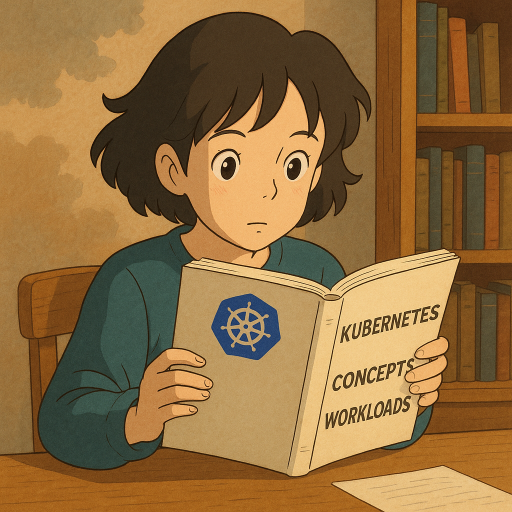

  

<!--more-->
[doc link](https://kubernetes.io/docs/concepts/workloads/)   

所謂的 Workloads 就是我們希望 k8s 幫忙執行的 container  
k8s 最小部屬單位是 pod, pod 內可以包含多個 container  
container 之間共享網路 IP  
  
那如果我有個 service 需要 APP + DB  
pod 該如何設計？ 
應該是各自一個 pod? 還是放在同個 pod?  
  
答案是 應該要APP, DB 各自一個 pod  
因為 k8s 在 scale 的時候  是以 pod 為單位  
通常 APP,DB loading 不會是對等的, 所以不會同時 scale  
另外一個原因 是因為 APP 通常是 stateless  
DB 是 stateful  

- stateless: replica, pod restart(or upgrade...etc) 之間不存在任何關係, 大家都是做一樣的事情,並獨立運作的個體  
- stateful: 就是與 stateless 相反  

而什麼時候會用到 pod 內多個 container  
通常來說 只有 monitor 相關的 container 才會住在同個 pod 內   

## workload resources
在 k8s 中 pod 的生命週期定義為 defined lifecycle   
如果今天 work node 掛了, pod 並不會在其他 work node 啟動 因為他已經 "defined"  
甚至該 node 回來也不會啟動 pod  

k8s 有另外的 workload resources 來 define pod lifecycle  
比如說 pod 該有多少 replica / 該住在哪些 work node 上  
你可以類比成 我們通常是使用 docker compose 來啟動 container 
而不使用 docker run  

因此雖然 k8s 最小部屬單位是 pod  
但實際上我們並不直接部屬 pod  
而是使用 workload resources

### k8s build-in workload resources

Deployment: good fit for managing a stateless application workload  

StatefulSet: good fit for managing a stateful application workload  

DaemonSet: 用來執行需要常駐在每個 work node 的 container  
其性質類似每個 node 需要的基本元件, 比如說 node monitor  
他會讓每個 node 都有這 pod, 並只會有一個 pod  

Job and CronJob: 執行一次行或是週期性的 pod  
與前面幾個 resource 不同的是 Deployment,StatefulSet,DaemonSet 會讓 pod 一直活著(running)  
Job and CronJob 則是允許 pod exit(stoped)

---

最後再強調一個 k8s 具有擴充能力  
如果你以上的 workload resource 不滿足  
k8s 提供了 CRD([custom resource definition](https://kubernetes.io/docs/concepts/extend-kubernetes/api-extension/custom-resources/))   
讓你可以新增你想要的 resource(不限於 workload)  
