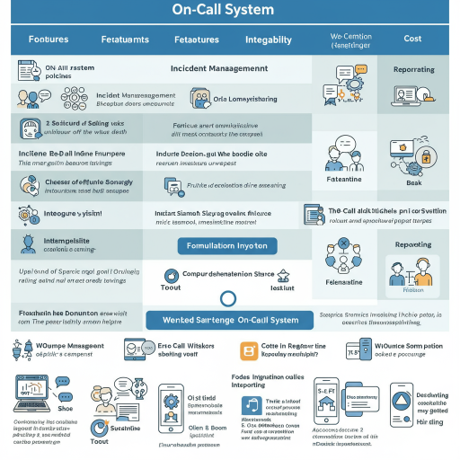

---  
date: 2025-06-17T01:17:00  
draft: false  
tags:  
- 'on-call'  
title: "Sharing the Implementation of the On-Call System"  
---  
  

<!--more-->  

## Prologue  
這篇分享我在團隊內導入 On-Call System 的過程  
裡面包含我們的需求  
所以不是什麼 best practice  
不會適用每個團隊  
採用前請大家做好評估  

----  

身為一個系統管理者  
為了要讓系統能不間斷的提供服務  
除了高可用性外  
有人 on-call 也是很重要的  
就算有 HA / auto-recovery  
然而再怎麼樣  
系統還是有可能有需要人介入的狀況  
因此有 monitor 就會有 alert 的需求  
但是光有 alert 其實還不夠  
我們可能會希望 alert 要能夠支援類似 phone-call  
還要根據 team member 排班有各自的通知對象  

因此 on-call system 就有它的存在性  

## On-Call System 目標  
下列出我們的需求  

- 接收 alert  
  至少支援 webhook  
- 發送 alert  
  至少支援  
    - call-out (phone-call)  
    - webhook  
- 支援排班  
- 提供 free tier  
  因我們本來就有 on-call 工具，只是很陽春，所以希望在不增加 cost 情況下  
  加強我們的 call-out  
- Alert Suppression  
  避免被 alert 轟炸  

## On-Call System Comparison  

在經過 Google Search 後  
列出當時幾個系統的評估  
但有可能有錯/改變  
各位務必再評估過  

**last update: 2025/06/17**  

* [alertops](https://alertops.com)  
free tier 5 users  
難以理解,不會用  
沒有 per-service integration  
要等試用期結束才能切免費  
app 功能普通 沒有 ack 機制  

* [pagerduty](https://www.pagerduty.com)  
free tier 5 users  
Integrations 可以整合 Outbound Integration (e.g., trigger webhook)  
free 可以用 schedule override  
but On-call Schedules 只能 1 個，因此無法分 primary/secondary member  

* [taskcall](https://taskcallapp.com/pricing)  
free tier 5 users  
沒辦法匯出 schedules  
Web UI 有點慢  

* [atlassian opsgenie](https://www.atlassian.com/software/opsgenie/pricing)  
free tier 5 users  
跟 zenduty 比限制較少  
API 有 Request Limits 怕 alert 發不出來  
free tier Routing Rules 沒辦法分 service  
多 incident per service 不知如何應用  

* [grafana OnCall](https://grafana.com/products/cloud/oncall/)  
a part of Grafana Cloud IRM  
free tier 3 users  
整合 Grafana 生態系，方便現有 Grafana 用戶  

* [zenduty](https://zenduty.com)  
free tier 5 users  
override schedule 須付費才能使用  
換班較麻煩  
Android/iOS app 好用，會發 alert (像國家警告系統那樣，有 phone-call 效果，而不是單純的訊息通知)  
web, app 反應稍慢  

* [xmatters](https://www.xmatters.com)  
free tier 10 users  
region 有亞太 (反應比較快)  
Outbound Integration https://zyxel-nebula.xmatters.com/xmatters/signOn.do 很現代  
需要時間學習  

* [squadcast](https://www.squadcast.com)  
free tier 5 users  
Android/iOS app 好用，會發 alert  
免費有 override schedule  
也有 Analytics  
web, app 反應快上不少  
跟 zenduty 比感覺更好用  

**評估結果**  
依功能評估：xmatters > opsgenie > squadcast > zenduty  
依實用性評估：squadcast > zenduty > xmatters > opsgenie  

## why chose squadcast  
最後我們採用了 squadcast 來增強我們既有的 on-call system  

以下列出採用原因  
- free tier 5 user  
  對於 small team 的我們夠用  
- Push Notifications is Unlimited  
  不怕頂到 limit 變成通知發不出來  
- phone call 用完就沒了  
  跟其他家不同 其他都是 Monthy limit  
  不過這點不影響, 因為其他家 free-tier quoda 也不多  
  都是不夠用的情況  
  這部份仰賴我們既有的 call out system  
- Native Integrations with Alert Sources & Custom Integrations via API  
  除了原生整合 alert source 外  
  也能 call API  
  讓系統不受限制  
- On-Call Schedules  
  最重要的  就是排班機制  
  他能夠設定多個 Schedules  
  我們設定了 primary & backup  
  如果 primary 意外沒收到 alert, backup 可以處理  
- Schedule Overrides  
  如果 on-call member 有事 能夠 Overrides schedules 讓其他 member 暫時 on-call  
  而不需要重新調整排班  
  舉例來說 member 輪班 interval 是一週  
  Schedules 會設定為 routing 的狀態  
  
  
graph LR;  
    A --> B --> C --> D  
    D --> A  
  

  而有人請假的話 就可以使用 Overrides 功能  
  而不用修改 Schedule  

- Escalation Policies  
  因為 squadcast 收到 alert 時會有幾個階段  
  
graph LR;  
    initial[send alert]  
    ack[on-call member acknowledge]  
    resolve[on-call member resolve alert]  
    initial --> ack --> resolve  
  
  
  前面提到 Schedules 有 primary/backup  
  如果 primary member 沒接到 alert  
  這裡可以設定時間經過 N 後沒有人 acknowledge 的話  
  就通知 backup member  

- Alert Deduplication  
  當 alert 發生時 相關的 service 受影響的話可能也會發 alert  
  Dedup 可以避免 oncall member 一直收到 notify 而無法專心處理 alert  

- API Request Unlimited Limits  
  避免 alert 送不出來  
- Mobile App (Android & iOS)  
  他們有自己的 APP  
  APP 能夠設定 "Bypass Do Not Disturb"  
  避免因手機設定沒收到 alert  
  其效果就像國家警報系統  極盡可能讓你避免 alert 未收到  
- 能夠整合 Slack  
- 能夠設定多個 Services  
  不同 service 會有不同的 on-call member  
  也能接各自的 alert source & target (比如說不同 slack channel)  

- MTTA / MTTR Performance Report & User and Incident Based Analytics & Organization and Team Based Analytics  
  老闆最愛看
