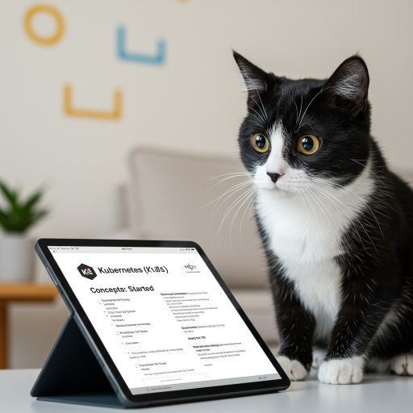

  

<!--more-->

[doc link](https://kubernetes.io/docs/setup/learning-environment/)  

## Introduction

前面稍微介紹 k8s 後  
先來個簡單的 getting start(LAB)  
開始實際接觸 k8s  
後面的介紹 就可以一邊學一邊實做下去了  

首先 k8s 有不同的 distibution 請參考 [distribution-compare](/posts/20250612_k8s-distribution-compare/)  
這邊我們採用 k3s 作為 LAB 環境  
他的優點是簡單且環境單純  
可以讓我們後續學習更加順利  

那為什麼不直接用原生 k8s ?
因為原生 k8s 安裝非常麻煩  
順利安裝少說半小時起跳  
因為步驟很多, 出錯機會也非常大 因此非常不建議使用  

因此官方的 getting start 也不是採用原生 k8s  
是使用 kind or minikube (挨 不是... getting start 你幹麻讓人選擇障礙啊啊啊)  
但兩套我都不建議使用  
請跟我一樣使用 k3s  
detail 可見 [k3s introduction](/posts/20250612_k3s-introduction/)  

## install k3s

**Prerequisites**   
a linux VM (best use ubuntu 24.04) with 2 core/2G RAM  

**install**  
```bash
# install
curl -sfL https://get.k3s.io | sh -s - --write-kubeconfig-mode 644

# config for easy use k3s
tee -a ~/.bashrc <<EOF
source <(k3s kubectl completion bash)
alias kubectl="k3s kubectl"
alias k="k3s kubectl"
complete -o default -F __start_kubectl k
EOF

source ~/.bashrc
```

檢查 install status  
如果 為 Ready 代表安裝完成  
```bash
k get node 
NAME    STATUS   ROLES                  AGE    VERSION
node1   Ready    control-plane,master   112s   v1.32.5+k3s1
```

說明一下  
前面有說過  不同 distribution add node 方式不同  
因此前面(k8s doc reading: Concepts - Cluster Architecture: Node) 有說簡單了解即可  
另外採用 k3s 我們也不會用到 `kubeadm`  
所以這篇會跟官方的 getting start 有差異  

前面提過  我們在操作 k8s 時  都是使用 `kubectl`  
而 k3s cli 內建 kubectl 了  
因此不必再另外安裝

最後我們設定 alias `k="k3s kubectl"`  
這是官方的小 tips [quick-reference](https://kubernetes.io/docs/reference/kubectl/quick-reference/) 

畢竟這樣方便許多  
許多人都是這樣使用 k8s  
為了讓大家都能看懂別人在說什麼
因此 `k` 就是指 `kubectl` 是基本常識喔   

## deploy first app

首先回憶 k8s 是採用 declarative configuration  
也就是說 我們都是寫 config(yaml format) 給 k8s 看  
對等就是 docker compose file 啦  

現在我們直接使用現成的 yaml 來部屬第一個 app 

```bash
$ k apply -f https://k8s.io/examples/controllers/nginx-deployment.yaml
deployment.apps/nginx-deployment created
```

這邊說明 我們在 k8s 建立了一個 `deployments.apps` 叫 `nginx-deployment`
> deployments.apps 就是前面說的 deployments
> 也可以用縮寫 deploy 

觀察結果
```bash
$ k get deploy 
NAME               READY   UP-TO-DATE   AVAILABLE   AGE
nginx-deployment   3/3     3            3           2m24s
```

這邊可以看到 READY: 3/3  
代表我們起了 3 個 replica 並且已經啟動完成   

我們可以用 `get pod` 加上 `-o wide` 看到更多訊息
```bash
$ k get pod -o wide 
NAME                                READY   STATUS    RESTARTS   AGE     IP           NODE    NOMINATED NODE   READINESS GATES
nginx-deployment-647677fc66-7htfr   1/1     Running   0          9m44s   10.42.0.10   node1   <none>           <none>
nginx-deployment-647677fc66-ncs5s   1/1     Running   0          9m44s   10.42.0.9    node1   <none>           <none>
nginx-deployment-647677fc66-p8627   1/1     Running   0          9m44s   10.42.0.11   node1   <none>           <none>
```

## expose app in cluster

在前面我們讓 app(nginx) 起來了
但是如果 cluster 內有其他 pod 要來 access app(nginx) 該怎麼做到的？  
這時我們要用到 k8s 的 service (後面會介紹)  

```bash
$ k apply -f https://k8s.io/examples/service/nginx-service.yaml
service/nginx-service created

$ k get service
NAME            TYPE        CLUSTER-IP     EXTERNAL-IP   PORT(S)    AGE
nginx-service   ClusterIP   10.43.163.91   <none>        8000/TCP   13s
```

我們可以看到 k8s 提供了一個 ClusterIP  
其他 pod 只要 access 這個 10.43.163.91:8000 就可以存取到 app(nginx)  
且是 random 存取 3 個 app(nginx) pod  
因此 replica 的應用在 k8s 是非常簡單能夠達成  

## expose app in host

前面利用的 service 是讓 app(nginx) 能夠在 cluster 內部給其他 pod access  
但如果是要給外部存取呢？  
> ClusterIP/ pod IP 是一個 overlap IP  
> 只有在 cluster 內部才能存取

我們來編輯剛剛的 service 
`k edit service nginx-service` 
修改 spec.type 由 `ClusterIP` 改為 `LoadBalancer`  
並存檔離開(default 是使用 vi 編輯器)  

這時再看一次狀態 
```
$ k get service
NAME            TYPE           CLUSTER-IP     EXTERNAL-IP      PORT(S)          AGE
nginx-service   LoadBalancer   10.43.163.91   192.168.56.101   8000:31509/TCP   15m
```

可以看到 EXTERNAL-IP 有東西了
這時只要用 browser 打開 `http://192.168.56.101:8000` 
就可以看到結果了  


## cleanup 
最後來把 lab 建立的 service/deployment 刪除

```bash
$ k delete service nginx-service
service "nginx-service" deleted

$ k delete deployments.apps nginx-deployment 
deployment.apps "nginx-deployment" deleted
```
## Conclusion

快速的 LAB 操作之後  
應該會對 k8s 的操作有基本認識  

我們先不要了解 yaml (manifest) 的語法  
這個要等到對 k8s 有更進一步認識後才會有辦法說明  
接下來會就能一邊介紹 k8s 並同時有 LAB 環境讓大家實際上手演練了  
