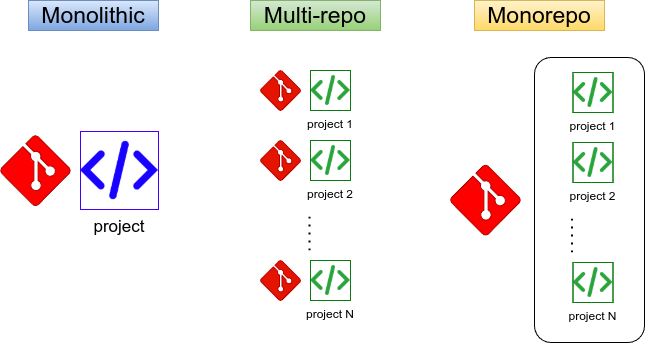

  

<!--more-->

## Introduction
monorepo 的由來是在大型 project 中 source code 的存放方式的改進方式

先說最原始架構  
**monolithic:**  
將所有功能加到一個 project 並使用一個 git repo 管理 就叫  monolithic  
當 feature 越來越多時,就會導致開發越來越困難  
因為太"大"了  
且不利於做微服務  

**Multi-repo:**  
因為 monolithic 不易於維護及微服務化  
就將 feature 拆成小 project/library 並存在各自的 repo 中  
可是這樣很快就面臨挑戰  
每次上 code 可能就要開多個 PR/MR  
也不利於進行 CI 相關測試  
當 repo 越來越多時  
開發就會非常困難  

**Monorepo:**  
簡單來說就是要結合 monolithic and Multi-repo 兩者的優點  
使用 monolithic 的管理方式  

讓 source code 能以 Multi-repo 的方式儲存  
並將所有的 project/library 存放於單一 repo 中    

示意圖  

## Conclusion

不過 Monorepo 也不是簡單把 project/library 通通丟到一個 git repo 而已  
當 source code 越來越大  
我們要做微服務那就需要人幫忙管理 project/library 之間的關係  
如果每次 release 都是所有 source code 全包 就又回到 monolithic 了  

> 現今很多 runtime manager 也直接支援 monorepo 的概念  
比如 golang 的 [Workspaces](https://go.dev/ref/mod#workspaces)   

就算 runtime manager 有支援 monorepo 的概念  
再來會碰到的就是 CI 效率問題  
舉例如果我們每次做 lint 都是對所有 source code 執行  
而不是對異動的 project/library  
那顯然很沒效率  

因此導入 monorepo 接著要解決的是 dependencies(相依性) and performance(效率) 問題  

後面篇幅會以 python 為例, 介紹兩款 tool `uv`, `moon`  

