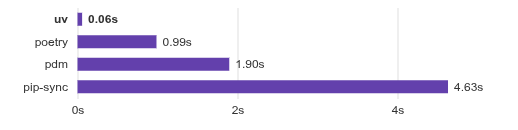

  

<!--more-->

## Introduction
**runtime manager:**  
在軟體開發中，我們使用 python 來執行我們的程式碼  
python 就是所謂的 runtime  
而任何 runtime 都會隨著時間發布新版本  
為了統一團隊之間的 runtime 版本, 我們前面介紹了 [mise](/posts/20250618_mise/)  
mise 就是一個 runtime manager  

**package manager:**  
大部分得程式語言都支援 import 功能  
簡單來說就是把 code 模組化  
讓要用到的地方能夠 re-use  
而這些被模組化的 code  
就會成為一個 Python package  
通常會被 release 到 [pypi](https://pypi.org)  

那個要去下載這些寫好的 package  
就需要夠過 package manager 去下載  
並透過 package manager 管理版本  

## what is uv
[official site](https://docs.astral.sh/uv/)

今天要介紹的 `uv` 就是一個 package manager  
但他其實也身兼 runtime manager  
能夠幫忙管理 python version  

不過我的習慣還是夠過 `mise` 管理  
畢竟 `mise` 能夠管 `uv` 也能管 python 甚至其他 tool  
單一 tool 也能降低維護難度  

**uv 的目標**
`uv` 是一個由 Astral 開發的現代化 Python 套件安裝器和解析器，旨在成為 `pip` 和 `pip-tools` 的快速替代品。它用 Rust 編寫，提供了極快的性能，並支援 `pyproject.toml` 和 `requirements.txt` 等標準。`uv` 的主要優勢在於其速度、可靠性以及對 monorepo 環境的良好支援。

重點功能  
- 10-100x faster than pip.  
- Provides comprehensive project management, with a universal lockfile.  
- Supports Cargo-style workspaces for scalable projects.  
- Disk-space efficient, with a global cache for dependency deduplication.  

官方的 performance 測試結果  


首先他比 pip, poetry 快很多  
且 Disk-space efficient (使用 link 達成)  
省下時間與 disk resource  
對於常做大量 CI 環境下是很加分的項目  

再來他跟 poetry 一樣支援 lockfile 機制  
也就是能夠確保在不同環境下(team member/CI) 使用到的外部 package 是相同版本  
避免因環境不一致導致各種亂象產生  

然後他也支援 workspaces, 也就是 monorepo 的概念  

 
## uv workspace 
`uv` 的 workspace 幫助你在一個 git repo 中管理多個 Python 專案  
每個專案都可以有自己的 `pyproject.toml`  
而 `uv` 能夠有效地解析和安裝所有專案的 dependencies  
同時確保它們之間的相容性


以下是一個使用 Mermaid 繪製的 monorepo 結構圖，展示了 `uv` 如何管理不同專案的依賴：
  
  
---
title: Workspace
---
flowchart TD
    subgraph project
      P1(Project 1)
      P2(Project 2)
    end
    subgraph library
      L1(Library 1)
      L2(Library 2)
    end

    P1 -- dep --> L1
    P1 -- dep --> L2
    P2 -- dep --> L1
  

### start a git repo with mise managed runtime

首先利用 mise 管理 uv 及 python 版本

```bash
# query uv version 
$ mise ls-remote --all | grep uv
uv@0.7.13

# query python version 
mise ls-remote --all | grep python
python@3.13.5

# install uv and python with specific version  
mise use uv@0.7.13
mise use python@3.13.5
```

此時 repo 應該只有 mise.toml  
```bash
[tools]
python = "3.13.5"
uv = "0.7.13"
```

最終 你的結果應該是如此  
[demo git repo](https://github.com/owan-io1992/monorepo-demo/tree/mise) 


### initial uv workspace  
[doc link](https://docs.astral.sh/uv/concepts/projects/workspaces/)

前面提到 lockfile  
他的用途是紀錄下當下安裝的 python package version   
其他環境都是根據此 lockfile initial 開發環境的話  
就可以極大程度確保環境一致  

但是我們在 monorepo 環境下  
因為 IDE tool 的一些限制([vscode](https://www.reddit.com/r/vscode/comments/11od11x/is_vscode_able_to_cope_with_multiple_python/))  
要在 monorepo 下使用多個 virtualenv 是不方便的  
由於一個 lockfile 會對應一個 virtualenv  
因此必須把多個 lockfile(多個 project)  
統一為一個 lockfile 管理  

> 來自官方簡單說明  
> "a collection of one or more packages, called workspace members, that are managed together."


initial a python package with workspace enable 
```bash
$ uv init .
Initialized project `monorepo-demo` at `/home/nb/data/github/monorepo-demo`
```

delete un-need file  
```bash
rm -f main.py
.python-version
```

create projects/librarys folder structure  
```bash
$ mkdir projects
$ mkdir librarys
```

enable workspace  
編輯 pyproject.toml  
加上  
```bash
[tool.uv.sources]

[tool.uv.workspace]
members = ["projects/*", "librarys/*"]
```

最終 你的結果應該是如此  
[demo git repo](https://github.com/owan-io1992/monorepo-demo/tree/uv_workspace) 

### create projects/librarys 

再來我們分別在 projects/librarys 建立兩個 python package

```bash
WORKSPACE=`pwd`
cd ${WORKSPACE}/projects
mkdir project1 && cd project1 && uv init . 

cd ${WORKSPACE}/projects
mkdir project2 && cd project2 && uv init . 

cd ${WORKSPACE}/librarys
mkdir library1 && cd library1 && uv init . 

cd ${WORKSPACE}/librarys
mkdir library2 && cd library2 && uv init . 
```

最後的目錄結構應該為  
```bash
$ tree 
.
├── librarys
│   ├── library1
│   │   ├── main.py
│   │   ├── pyproject.toml
│   │   └── README.md
│   └── library2
│       ├── main.py
│       ├── pyproject.toml
│       └── README.md
├── main.py
├── mise.toml
├── projects
│   ├── project1
│   │   ├── main.py
│   │   ├── pyproject.toml
│   │   └── README.md
│   └── project2
│       ├── main.py
│       ├── pyproject.toml
│       └── README.md
├── pyproject.toml
└── README.md
```
project1,2 & library1,2 有各自的 pyproject.toml  
讓他們設定自身所需要 package  

之後我們在 root 下  
利用 uv 建立 .venv 執行 `uv sync`  
uv 便會將 project1,2 & library1,2 安裝到 venv 中了  

最終 你的結果應該是如此  
[demo git repo](https://github.com/owan-io1992/monorepo-demo/tree/uv_setup_workspace) 


### define project dependencies 
在前面我們將 project and library 放到 monorepo 中了  
可是該怎麼定義 project 與 library 之間的關係？ 

我這邊採用 uv 的 group 方式  
修改 pyproject.toml 加上以下內容
```
[dependency-groups]
project1 = [
  "project1",
  "library1",
  "library2",
]
project2 = [
  "project2",
  "library1",
]

[tool.uv.sources]
project1 = { workspace = true }
project2 = { workspace = true }
library1 = { workspace = true }
library2 = { workspace = true }

[tool.uv]
default-groups = "all"
```

我們定義兩個 `dependency-groups` 分別為 project1, project2  
而 group 內就是定義 monorepo 下的 package  

`tool.uv.sources` 則是要讓 uv 知道 這些 package 來自 workspace 內  
> default 是所有 workspace 內的 package 都會直接被當作 dependencies    
> 但因為採用 group 方式, 必須要再宣告一次  

最後在 tool.uv  
加上 default-groups = "all" 告訴 uv 如果沒特別指定 就使用 所有 group  

之後我們如果只需要 project1 的操作  
就可以在 uv 加上 --group 的參數

最後各自在 project & library 加入一些 dependencies 並測試看看  
```bash
$ uv export --group project1 --no-hashes
```
 
會看到只有 project1,library1,library2 的 package 被列出  
如此一來 後續要包成微服務就可以使用 group 方式進行  

最終 你的結果應該是如此  
[demo git repo](https://github.com/owan-io1992/monorepo-demo/tree/uv_setup_package) 

## Conclusion

uv 是一個相當高效率的 package manager  
並且支援 workspace 功能  
讓我們完成基本的 monorepo  
但還不夠  
如果我們導入 lint/formatter 功能的話  
就需要有人來協助了   
下一篇再繼續導入 moon 來強化 monorepo 的功能   