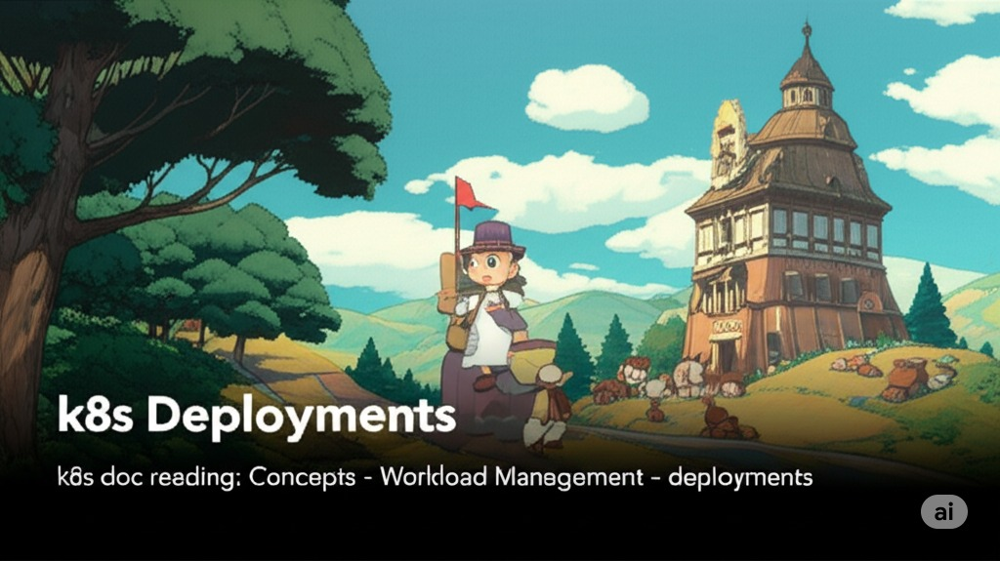

  

<!--more-->
[doc link](https://kubernetes.io/docs/concepts/workloads/controllers/deployment/)   

Deployment 是用來幫助執行 stateless 的 pod   
**stateless:**  
- 在 pod 的 replica 之間 不存在任何關聯  
- pod 在 start/restart/stop 後也不存在前後關聯  

簡單來說 每個 pod 都是個獨立運作的個體  

舉例來說 web-server 就適合使用 deployment  


## Creating a Deployment

在前面我們使用 範例去新增一個 deployment  
```bash
kubectl apply -f https://k8s.io/examples/controllers/nginx-deployment.yaml
```

為了方便說明  
我直接使用註解做講解  
有一些功能尚未介紹到 就請大家邊看邊學 後面會再做深入介紹  
```bash
apiVersion: apps/v1 # k8s 是跟 api server 溝通, api 版本會跟著 k8s 升級做異動, 因次升級務必做檢查
kind: Deployment # 告訴 k8s 要建立 deployment
metadata: 
  name: nginx-deployment
  labels: # k8s 在不同 resource 都是透過 labels 去建立關係 
    app: nginx
spec: # 開始定義 deployment 內容
  replicas: 3  # 宣告要建立一個 3 個 replica 的 ReplicaSet
  selector:    # ReplicaSet 的 labels
    matchLabels:
      app: nginx
  template:    # how ReplicaSet create pod
    metadata:
      labels:  # pod's labels
        app: nginx
    spec:  # 開始定義 pod 內容
      containers:
      - name: nginx
        image: nginx:1.14.2
        ports:
        - containerPort: 80
```

會注意到 labels 有三個地方會用到  
我們先了解 labels 必須一致 才能讓 deplyment 正常運作  
labels 是讓 deployment/replicaset/pod 這三個 k8s kind 能夠關聯起來的 metadata  
kind 就是 k8s 裡面的 object, 就是我們常說的(deployment/replicaset/pod...etc)   

ReplicaSet 基本上我們不直接用他  
交由 deployment 去管理  
詳細的語法可以參考 [kubernetes-api](https://kubernetes.io/docs/reference/generated/kubernetes-api/v1.33/)  建議 basic 都學完了再看  

使用官方提供的 manifest 新增一個 deployment  
```bash
kubectl apply -f https://k8s.io/examples/controllers/nginx-deployment.yaml
```

然後觀察狀態  
```bash
$ k get deployment
NAME               READY   UP-TO-DATE   AVAILABLE   AGE
nginx-deployment   3/3     3   
```

READY: 目標要三個 replica 並都已正常啟動
UP-TO-DATE: 顯示如果有任何 pod 已更新完成(如有進行 rolling update 可以觀察此項目) 

如要觀察詳細資訊 就使用 `describe`  
```
$ k describe deploy nginx-deployment 
Name:                   nginx-deployment
Namespace:              default
CreationTimestamp:      Sat, 21 Jun 2025 00:53:33 +0000
Labels:                 app=nginx
Annotations:            deployment.kubernetes.io/revision: 2
Selector:               app=nginx
Replicas:               3 desired | 3 updated | 3 total | 3 available | 0 unavailable
StrategyType:           RollingUpdate
MinReadySeconds:        0
RollingUpdateStrategy:  25% max unavailable, 25% max surge
Pod Template:
  Labels:       app=nginx
  Annotations:  kubectl.kubernetes.io/restartedAt: 2025-06-21T00:58:03Z
  Containers:
   nginx:
    Image:         nginx:1.14.2
    Port:          80/TCP
    Host Port:     0/TCP
    Environment:   <none>
    Mounts:        <none>
  Volumes:         <none>
  Node-Selectors:  <none>
  Tolerations:     <none>
Conditions:
  Type           Status  Reason
  ----           ------  ------
  Available      True    MinimumReplicasAvailable
  Progressing    True    NewReplicaSetAvailable
OldReplicaSets:  nginx-deployment-647677fc66 (0/0 replicas created)
NewReplicaSet:   nginx-deployment-756d74bd9 (3/3 replicas created)
Events:
  Type    Reason             Age    From                   Message
  ----    ------             ----   ----                   -------
  Normal  ScalingReplicaSet  5m59s  deployment-controller  Scaled up replica set nginx-deployment-647677fc66 from 0 to 3
  Normal  ScalingReplicaSet  89s    deployment-controller  Scaled up replica set nginx-deployment-756d74bd9 from 0 to 1
  Normal  ScalingReplicaSet  88s    deployment-controller  Scaled down replica set nginx-deployment-647677fc66 from 3 to 2
  Normal  ScalingReplicaSet  88s    deployment-controller  Scaled up replica set nginx-deployment-756d74bd9 from 1 to 2
  Normal  ScalingReplicaSet  87s    deployment-controller  Scaled down replica set nginx-deployment-647677fc66 from 2 to 1
  Normal  ScalingReplicaSet  87s    deployment-controller  Scaled up replica set nginx-deployment-756d74bd9 from 2 to 3
  Normal  ScalingReplicaSet  86s    deployment-controller  Scaled down replica set nginx-deployment-647677fc66 from 1 to 0
```


## Updating a Deployment 
> 這邊操作有印象即可  
> 實務來說  我們不會這樣使用   
> 通常會使用 IaC 來進行操作  

修改 image tag  
```bash
$ kubectl set image deployment/nginx-deployment nginx=nginx:1.16.1
deployment.apps/nginx-deployment image updated
```

這時 deployment 會幫我們進行 rolling update  
非常的簡單  
那如果我設定有問題的 image 呢？ 
```bash
$ kubectl set image deployment/nginx-deployment nginx=nginx:1.16.123
deployment.apps/nginx-deployment image updated
```

你還是會看到 deployment 顯示 image updated  
但是去看 pod 的狀態  
```bash
$ k get pod 
NAME                                READY   STATUS         RESTARTS   AGE
nginx-deployment-7d7b5bf757-vqm98   0/1     ErrImagePull   0          15s
nginx-deployment-85c89744b4-ddc2p   1/1     Running        0          2m4s
nginx-deployment-85c89744b4-t7qss   1/1     Running        0          105s
nginx-deployment-85c89744b4-wsdzg   1/1     Running        0          104s

$ k get deployment
NAME               READY   UP-TO-DATE   AVAILABLE   AGE
nginx-deployment   3/3     1            3           12m

```

因為這 tag 並不存在  
因此 pod STATUS 為 ErrImagePull   
deployment 會因為 pod 起不來  因此沒有繼續更新  
在新的 pod 尚未能運作前, deployment 並不會把舊的 pod 停掉  
因此一個簡易的 canary deploy 就出現了  

但也要注意一件事當我們對 deplyment set image 時  
並不會拿到一個 fail 的狀態   
因為會需要不斷的使用 get pod 觀察 update 狀態  
這個問題可以透過 [argoCD](https://argo-cd.readthedocs.io/en/stable/) 解決  


## Rolling Back a Deployment update 

> 這邊操作有印象即可  
> 實務來說  我們不會這樣使用   
> 通常會使用 IaC 來進行操作  

k8s 會紀錄你的變更紀錄 (預設 10 份)  
你可以使用

```bash 
# get update revision
kubectl rollout history deployment/nginx-deployment

# get detail update revision
kubectl rollout history deployment/nginx-deployment --revision=2

# Rolling Back to a Previous Revision 
kubectl rollout undo deployment/nginx-deployment --to-revision=2
```


## Scaling a Deployment 

如何修改範例的 replica 數量  
可以使用

```bash
kubectl scale deployment/nginx-deployment --replicas=10
```

但平常我們都會採用 auto scale  
因此人工 scale 只有在特殊狀況使用  

比如說我想暫時把 deploymnet 停了  
就可以使用 `--replicas=0` 而不必 delete replica  
```bash
kubectl scale deployment/nginx-deployment --replicas=0
```

## Failed Deployment 

前面有故意將 images tag 改為 1.16.123  
並看到 pod 出現 `ErrImagePull`  
如果你使用 `k describe pod` 可以看到更多細節

這邊就不贅述所有狀態了  
基本上養成善用 `describe` 來進行 debug 就是了  

## update Strategy 
預設情況下 k8s 採用 `RollingUpdate`  
也就是逐步更新  
可以使用 `Recreate`  
來一次行更新所有 pod  

### Rolling Update Deployment

RollingUpdate 可以修改他的行為  
default 情況下是

**maxUnavailable:** default 25%  
允許 pod stop 的量  
可以用絕對值 or 百分比  
  
當開始 rolling upgrade 時  
舊的 replica 會馬上停掉 25%  

**maxSurge:** default 25%  
允許 pod start 的量  
可以用絕對值 or 百分比  

當開始 rolling upgrade 時  
新增的 replica 會先啟動 25%  
 

因此只要控制 maxUnavailable, maxSurge 即可控制 rolling upgrade 的流程  