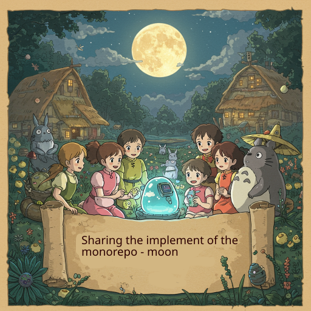

  

<!--more-->

## Introduction
先來看看 別人整理的 [why-a-monorepo](https://monorepo.tools/#why-a-monorepo)  

對我而言  最重要的幾個功能  
- Local computation caching
  monorepo 會將 repo 成長為一個巨型的 repo  
  如果每次 CI/CD 都要針對整個 repo 進行 computing 會非常沒效率  
  因此 cache 功能是必要的  
- Local task orchestration:  
  隨著 repo 越來越大, 內部的 project 會有相同/不同的 task , 並且可能有不同的相依性   
  這些 task 交由 monorepo tool 幫助我們簡化管理 

monorepo.tools 列出了常見的 monorepo tool  
而在經過我的評估後 我選擇了 moon 

其中理由如下  
- doc 夠清楚
  我評估過 bazel,nx  
  bazel: 經常被社群抱怨學習曲線過於陡峭, implement feature 慢,因此不少 repo 都決定棄用 bazel  
  nx: doc 非常不清楚, 你不看 source code 根本無法了解使用   
  後面再來篇詳細的比較
- feature first
  對比 nx, 有些功能就是標榜 enterprise 才能夠支援  
  moon 則是專注在提供社群新功能
- bug 修復快/少
  nx 有些 bug 甚至是 getting start 就會發生  
  但就是一直沒處理  
  相對 moon 在處理 issue 非常積極  


### install moon and initial 
[moon official site](https://moonrepo.dev/moon)
這裡一樣採用 mise 管理  
```bash
# list moon version
mise ls-remote --all | grep moonrepo

# install moon
mise use moonrepo@1.37.3
```

**initial moon**  
```bash
moon init
```

initial 後會在 建立一個 .moon folder 還有 .moon/workspace.yml configuration file  

首先在 workspace.yml 新增 config for version control system  
```bash
vcs:
  manager: 'git'
  defaultBranch: 'main'
```

這個的用意是讓 moon 能夠跟 branch main 進行比對  
找出異動的內容 藉此在執行 task 時 能夠限縮執行範圍來提昇效率  

**initial moon to know project**  

在 .moon/workspace.yml 修改 projects   
```bash
projects:
  - 'librarys/*'
  - 'projects/*'
```

> 對於 moon 來說都是 librarys/projects 都歸類在 moon 的 projects  
> 是 monorepo 管理的對象  

check moon 是否有抓到 project

```bash
$ moon query projects 
╭──────────────────────────────────────────────────────────────────────────────────────────────────────────────────────────────────────────────────────────────────────────────────────────────────────────────────────────────────────────╮
│Project        Source                  Stack             Type              Language       Toolchains                 Description                                                                                                          │
│──────────────────────────────────────────────────────────────────────────────────────────────────────────────────────────────────────────────────────────────────────────────────────────────────────────────────────────────────────────│
│library1       librarys/library1       unknown           unknown           python         system                                                                                                                                          │
│library2       librarys/library2       unknown           unknown           python         system                                                                                                                                          │
│project1       projects/project1       unknown           unknown           python         system                                                                                                                                          │
│project2       projects/project2       unknown           unknown           python         system    
```

最終 你的結果應該是如此  
[demo git repo](https://github.com/owan-io1992/monorepo-demo/tree/moon_initial)   

### add dependencies for project

雖然我們在 uv 有定義過 dependencies  
但在 monorepo 也需要定義一次  
> 在某些 language, moon 有跟 package manager 整合　
> 根據情況可以調整
　
在每個 project 下都新增一個 moon.yaml  
這是用來給 per-project 的設定  

我們在  
projects/project1/moon.yml 新增  
```bash
dependsOn:
  - "library1"
  - "library2"
```

projects/project2/moon.yml 新增  
```bash
dependsOn:
  - "library1"
```

這樣　moon 就有基本的關聯 dependencies 關聯  

最終 你的結果應該是如此  
[demo git repo](https://github.com/owan-io1992/monorepo-demo/tree/moon_project_init)   

### add task for all project

moon 提供了 inherit task 跟　project task  
inherit task 用來 global 套用在 多個　project  
可以避免同樣的 task 重寫 N 次  
project task 可以再 override inherit task 來增加彈性  

我們先建立 [inherit task](https://moonrepo.dev/docs/concepts/task-inheritance) 

建立 file `.moon/tasks.yml`  
```bash
tasks:
  build:
    command:
      - 'echo'
      - 'exec build'
```

測試  
```bash
$ moon :build
▪▪▪▪ project2:build (1aebba0d)
project2:build | exec build
▪▪▪▪ library2:build (af690d4b)
▪▪▪▪ project2:build (1ms, 1aebba0d)
library2:build | exec build
▪▪▪▪ library1:build (afd1c059)
▪▪▪▪ library2:build (1ms, af690d4b)
library1:build | exec build
▪▪▪▪ project1:build (610f9c41)
▪▪▪▪ library1:build (1ms, afd1c059)
project1:build | exec build
▪▪▪▪ project1:build (1ms, 610f9c41)
Tasks: 4 completed
 Time: 17ms
```

`moon :build` 是對所有 project 執行 build task  
如果再次執行 可以看到因為 project 沒有異動, 因此會直接使用 cache, 藉此來加速 task 執行  
```bash
project1:build | exec build
▪▪▪▪ project1:build (cached, 610f9c41)

(其他 略...)
```

接著嘗試 override task  
編輯 `projects/project1/moon.yml`
```bash
tasks:
  build:
    args: 'extra override'
```

再次執行 `moon :build` 可以觀察到 task output 不同了

```bash
project1:build | exec build extra override
▪▪▪▪ project1:build (1ms, f99d9697)
```


這次我們執行 `moon project1:build` 這代表請 moon 幫忙執行 project1 的 build  
會看到只有 project1 的 task 被執行　
```bash
$ moon project1:build
project1:build | exec build extra override
▪▪▪▪ project1:build (cached, f99d9697)

Tasks: 1 completed (1 cached)
 Time: 7ms ❯❯❯❯ to the moon
```

但某些 task 我們希望相依的 project 也要執行  
我們修改 .moon/tasks.yml 加上 deps ^ 代表其使用 dependsOn 所有 project    
```bash
tasks:
  build:
    command:
      - 'echo'
      - 'exec build'
    deps:
      - ^:build
```

執行結果  
可以看到因為 project1 deps 包含 library1,library2 因此也會跟著執行  
```
$ moon project1:build
▪▪▪▪ library2:build (f2a3dc8a)
library2:build | exec build
▪▪▪▪ library2:build (f2a3dc8a)
▪▪▪▪ library1:build (6775252c)
library1:build | exec build
▪▪▪▪ library1:build (1ms, 6775252c)
▪▪▪▪ project1:build (76c8ed7f)
project1:build | exec build extra override
▪▪▪▪ project1:build (76c8ed7f)

Tasks: 3 completed
 Time: 20ms
```


最終 你的結果應該是如此  
[demo git repo](https://github.com/owan-io1992/monorepo-demo/tree/moon_sample_task)   

## Conclusion


以上就是簡單的 monorepo task 　
moon 能提供的遠不如此  

好好善用的話 不只可以簡化 monorepo 管理  
也因為 cache 機制 能大幅提昇 CI/CD 效率

