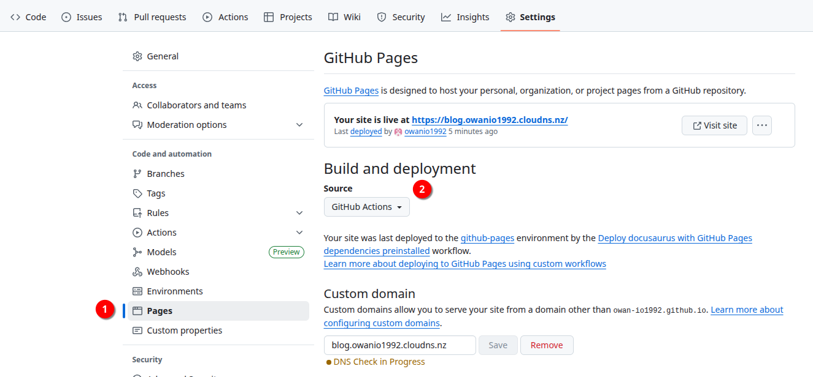

<!--more-->

## Introduction
hugo 是一個 static site generator  
除了找 [web server](https://free-for.dev/#/?id=web-hosting) 外  
也可以使用 github page 來 host 

一般的 web server 都會提供 php,DB 等來讓 web 能進行動態功能  
但是缺點是需要額外的 knowhow 且有更新/漏洞等問題  
隔壁的 wordpress 就是

因為 hugo 是產生 static site 可以說相對單純容易維護, 不過當然也會有功能較差的問題  
因此 static site 也是有一部份支持者  
也越來越多網站採用此設計  


## github page 
由 github 提供的服務  
讓大家能夠放上 static site  
不僅速度快又不用錢  
又能配合將 source code 放在 github 中做儲存/版控  
是個工程師很愛的地方, 本站也是採用 github page 做 host    

開始前  
github page 讀取 static content 有兩種方式  
- repo
- artifact

採用 repo 方式會相對簡單, 但既然身為一個工程師  
CICD 的玩法才是有趣的目標🤓   
於是這邊採用 artifact(github action) 幫忙執行 build/upload artifact/deploy page  

## setup cicd 

### setup github runner
github runner 就是在執行 workflow 的 worker  
可以使用 github 的免費額度   
或是使用 self-host runner   
因為我自己有台 VPS, 所以採用 self-host runner  
另外因為 self-host runner 是採用 per repo  
建議建立一個 organization, 在這可以建立 runner group,就可以一個 self-host runner share 給多個 repo 使用  


self-host runner 再使用 systemd 帶起  
就可以不必每次開關機 VM 都還要手動帶起了

systemd config
```bash
# /etc/systemd/system/actions-runner.service
[Unit]
Description=GitHub Actions Runner
After=network.target syslog.target

[Service]
ExecStart=bash run.sh
WorkingDirectory=/home/github-runner/actions-runner
User=github-runner
Group=github-runner

Restart=always
RestartSec=10s
StandardOutput=journal
StandardError=journal
SyslogIdentifier=actions-runner
KillMode=process
TimeoutStopSec=5min # Give it time to finish a job or shut down gracefully

[Install]
WantedBy=multi-user.target
```

### setup repo
因為採用 cicd 方式  
我們的 repo 不保留 public folder (generate by hugo)  
此 folder 為最後 hugo 產生的 static content, 這個要交由 github runner 產生  

在 .gitignore 加上 `public/`  解決
[.gitignore](https://github.com/owan-io1992/blog/blob/main/.gitignore)


### setup github workflow
在這一步我們要告訴 gitlab runner 要做什麼  
請參考 [workflow](https://github.com/owan-io1992/blog/blob/main/.github/workflows/hugo-gh-pages.yml)

簡單來說就是
- checkout main branch (github page limit)
- hugo build static file
- upload artifact
- deploy artifact to page

### setup page
再接下來要開啟 page 功能  
到 settings/pages  
設定 source 為 githab action 



這邊建議再申請一個 free dns 設定 Custom domain  
因為 page default 會給 `<username>.github.io/<repo name>`  
在 uri 部份會有個 repo name 為 prefix  
在部份 search engine 最佳化會碰上些問題(之後再細說)

### push code

最後只要 push code 到 main branch  
觀察看看 action 狀況即可
